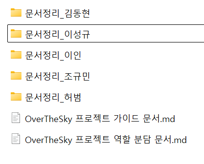

# OverTheSky 프로젝트 가이드

## 목차
1. [프로젝트 개요](#1-프로젝트-개요)
2. [팀 협업 규칙](#2-팀-협업-규칙)
3. [기술 스택 및 제약사항](#3-기술-스택-및-제약사항)
4. [개발 환경 설정](#4-개발-환경-설정)
5. [플레이어 시스템](#5-플레이어-시스템)
6. [이동 시스템 구현](#6-이동-시스템-구현)
7. [트러블슈팅](#7-트러블슈팅)
8. [개발 워크플로우](#8-개발-워크플로우)
9. [참고 자료](#9-참고-자료)

---

## 1. 프로젝트 개요

### 기본 정보
- **프로젝트명**: OverTheSky
- **장르**: 온리업 (Only Up) / 등산 게임
- **개발 기간**: 8일 (2026-01-28 ~ 2026-02-04)
- **팀 구성**: 5인 (이성규, 김동현, 이인, 조규민, 허범)
- **개발 환경**: Unity 2022.3.62f2 / C#

### 프로젝트 목표
- 온리 업 장르의 게임을 프로토타이핑을 통해 최대한 빨리 개발
- 개별 작업 노트 작성으로 문서화 및 소통 효율성 향상
- 에셋보다 **구현을 최우선**으로 삼음
- Rigidbody 기반 물리 시스템을 직접 구현하여 학습

### 작업 일정 (참고)
| 날짜 | 단계 | 주요 업무 |
|------|------|-----------|
| 1일차 | 프로토타입 | 플레이어 통합, 핵심 로직(이동, 점프, 충돌) 테스트, 역할 분담 |
| 2일차 | 기능 구현 1차 | 기믹 시스템 구현, 체크포인트, 리스폰 |
| 3일차 | 기능 구현 2차 | 맵 배치, UI 구현, 추가 기믹 |
| 4일차 | 통합 테스트 | 전체 기능 연동, 버그 수정 |
| 5일차 | 폴리싱 | 밸런스 조정, 비주얼 개선, 최종 테스트 |
| 6일차 | 문서화 1차 | 기술 문서, 구현 내역, 코드 주석 정리, 버그 수정 |
| 7일차 | 문서화 2차 | 트러블슈팅 정리, 회고록, 발표 자료 작성 |

### 디자인 에셋 사이트
- **오픈 게임 아트**: https://opengameart.org/
- **스카이박스**: https://polyhaven.com/hdris
- **믹사모 애니메이션** (사용 가능성 낮음): https://www.mixamo.com/#/

---

## 2. 팀 협업 규칙

### 2.1 그라운드 룰

#### 씬 관리 원칙
- **MainScene 절대 건드리지 않기**: 씬 배치는 기본적으로 팀장이 전담
  - 맵 배치나 레벨 디자인도 프리팹 형식으로 조립하는 형식으로 진행함
- **개인 테스트는 `Test_이름` 씬에서**: 각자 폴더에서 자유롭게 테스트
- **프리팹화 필수**: 작업물은 반드시 프리팹으로 만들어 제출
- **씬 수정 시**: 팀원에게 먼저 알리기 (기본적으로 팀장 관리)
- **타인 작업 영역**: 무통보 수정 금지, 필요시 통보 및 협업

#### 충돌 방지 규칙
- 자기 담당 영역에서만 작업
- 작업 해보고 싶으면 복사본 생성 → 컨펌 받고 적용
- 구현 완료 시 프리팹화
- 다른 사람 영역 수정 필요 시 통보 필수

#### 빌드 및 공유
- **1일 1회 빌드 의무** (윈도우 빌드 기준)
- 하루 최소 1회 Pull Request 필요
- 장시간 막힐 시 즉시 공유하고 함께 해결
- 매일 간단한 진행 상황 공유

#### 복구 방법
- 오류 시 Git Checkout으로 파일 되돌리기
- 씬이면 메타파일까지 함께 복구 (매우 중요)
- 충돌 방지를 위해 조심스럽게 작업

### 2.2 Git 워크플로우

#### 브랜치 전략
1. **`main`**: 최종 빌드 및 배포용 (직접 푸시 절대 금지)
2. **`develop`**: 개발 통합용 (모든 PR은 여기로)
3. **`Feat/기능명`**: 개인 작업 브랜치

**작업 순서**:
```
develop에서 브랜치 생성 
→ 작업 
→ develop으로 PR 
→ Merge 후 브랜치 삭제
```

#### 커밋 컨벤션
- **브랜치 prefix**: 대문자 사용 (예: `Feat/moving-platform`)
- **커밋 메시지**: 소문자 사용 (예: `feat: 이동 발판 구현`)
- **커밋 전 필수 체크**: 콘솔 에러 0개, 테스트 플레이 완료

**커밋 메시지 prefix**:
- `feat:` - 새로운 기능 추가
- `fix:` - 버그 수정
- `docs:` - 문서 수정
- `refactor:` - 코드 리팩토링
- `test:` - 테스트 코드
- `chore:` - 빌드, 설정 변경

참고: [브랜치와 커밋 메시지 가이드](https://code-angie.tistory.com/177)

### 2.3 소통 규칙

#### 필수 통보 사항
- 머지 완료 시 디스코드 통보
- 외부 플러그인 추가 시 통보
- 일정 문제 발생 시 미리 통보
- 장시간 막힐 시 즉시 공유

#### 문서 관리
- 노션 문서 자유롭게 수정 가능
- 반영 원할 시 팀장에게 요청
- 깃허브 문서 작성
  - **작업 노트**: 각자 기능 브랜치에서 자유롭게 작성/수정
  - **가이드/역할 분담 문서**: 팀장만 수정 (별도 브랜치)
    - 수정 필요 시 팀장에게 요청
    - 팀장이 `Docs/업데이트내용` 브랜치로 작업 후 `develop`에 머지
  - 작업 노트 파일은 각자의 폴더에서 작성
  

#### 태도 및 작업 관련
- 작업 시간 중 게임 금지
- 각자 컨디션 관리 (무리 금지)
- 테스트용 플레이어는 업로드하지 않고 로컬에서만 사용

### 2.4 에셋 관리

#### 유료 에셋
- **GitHub 업로드 절대 금지** (라이선스 이슈)
- 모든 외부 에셋은 `Imports` 폴더에 모아두고 `.gitignore` 처리

#### 외부 플러그인
- 사용 전 라이선스 확인 및 팀장 승인 필수
- 해당 경로 `.gitignore` 처리
- 저작권 문제 없이 직접 제작한 플러그인은:
  - 개인 작업 노트에 작업 내역 추가
  - 이그노어 처리 없이 업로드 가능

---

## 3. 기술 스택 및 제약사항

### 3.1 사용 가능 기술
- ✅ Rigidbody 기반 물리
- ✅ 수동 중력 제어
- ✅ Velocity 기반 이동
- ✅ ProjectOnPlane을 통한 경사 처리
- ✅ SphereCast/CapsuleCast 충돌 감지

### 3.2 사용 불가 (학습 목적)
- ❌ Character Controller 컴포넌트
- ❌ Physics Material

### 3.3 네임스페이스 구조
규칙: 하이브리드 방식 (Core 통합, 그 외 계층화)
1. Core 폴더 (단일화)
   - Core 하위의 모든 스크립트(Managers, Singletons, Utils, Bases)는 접근 편의성을 위해 하위 네임스페이스 없이 통일함.
2. 그 외 폴더 (계층화)
   - Core를 제외한 나머지(Player, Gimmicks 등)는 폴더 구조를 따라가는 네임스페이스를 사용한다.
**주요 네임스페이스 목록**:
- `OverTheSky.Core` : 매니저, 싱글톤, 유틸리티, 공용 베이스 (통합)
- `OverTheSky.Player` : 플레이어 관련 로직
- `OverTheSky.Gimmicks.Platforms` : 이동/상호작용 발판
- `OverTheSky.Gimmicks.Obstacles` : 방해물 및 함정
- `OverTheSky.Gimmicks.Zones` : 특정 구역(바람, 중력 등) 로직
- `OverTheSky.UI` : UI 및 HUD 관련
- `OverTheSky.Systems` : 게임 룰, 세이브 등 시스템 로직

**하위 폴더 규칙:**
하위 폴더 생성 시 `루트.상위.하위` 형태로 작성
- 예시: `OverTheSky.Gimmicks.Platforms`

### 3.4 코드 컨벤션

#### 네이밍 규칙
```csharp
// 클래스: PascalCase
public class PlayerController { }

// 메서드: PascalCase
void MovePlayer() { }

// 변수: camelCase
float moveSpeed;

// private 필드: _camelCase (선택)
private float _currentSpeed;

// 상수: UPPER_CASE
const float MAX_SPEED = 10f;

// 프로퍼티: PascalCase
public bool IsGrounded { get; private set; }
```

#### 주석 작성
```csharp
// ✅ 좋은 주석 - WHY를 설명
// 경사면에서 이동 방향을 바닥에 투영하여 자연스러운 이동 구현
moveDir = Vector3.ProjectOnPlane(moveDir, groundNormal);

// ❌ 나쁜 주석 - WHAT만 설명
// 벡터 계산
moveDir = Vector3.ProjectOnPlane(moveDir, groundNormal);
```

### 3.5 싱글톤 사용 주의사항
- Awake를 virtual로 선언하여 사용
- 상속받는 매니저 클래스에서 override 시 **반드시 `base.Awake()` 호출**

---

## 4. 개발 환경 설정

### 4.1 폴더 구조
```
Assets/
├── ... (Imports, Materials 등)
└── Scripts/
    ├── Camera/
    │   └── CameraController.cs
    │
    ├── Core/                   # 프로젝트 핵심 기반 (Namespace: OverTheSky.Core)
    │   ├── Bases/              # 범용 부모 클래스 (State, FSM 등)
    │   ├── Managers/           # 게임 매니저 (GameManager, InputManager)
    │   ├── Singletons/         # 싱글톤 템플릿 (Singleton)
    │   └── Utils/              # 유틸리티 도구 (Logger, Define)
    │
    ├── Gimmicks/               # 맵 기믹 & 오브젝트
    │   ├── Obstacles/          # 방해물 (RotatingBar, Hammer)
    │   ├── Platforms/          # 발판 (PlatformBase, MovingPlatform)
    │   └── Zones/              # 영역 효과 (WindZone, AntiGravity)
    │
    ├── Player/                 # 플레이어 로직
    │   ├── PlayerController.cs
    │   └── PlayerAnimation.cs
    │
    ├── Systems/                # 게임 시스템
    │   ├── CheckpointSystem.cs
    │   └── RespawnSystem.cs
    │
    └── UI/                     # UI 로직
        ├── MainMenu.cs
        └── HUD.cs
```

### 4.2 레이어 설정
- **Layer 3: Ground** - 밟을 수 있는 모든 땅/발판
- **Layer 6: Player** - 플레이어 본인
- **Layer 7: Wall** - 벽타기 방지용 (필요시)

**Physics 설정** (Edit > Project Settings > Physics):
- Player 레이어끼리 충돌 체크 해제 (카메라 뚫림 방지)

### 4.3 설치된 플러그인

#### RiderFlow `.gitignore`
- 씬뷰 북마크 기능
- 에디터 내 코드 수정
- 카메라 시점 저장

#### SnapToFloor `.gitignore`
- 게임오브젝트 선택 후 `End` 키 → 자동으로 바닥에 스냅

#### ProBuilder
- 프로토타입 맵 제작
- 폴리곤 수 최적화
- Auto UV 타일링

#### Unity 패키지
- **TextMeshPro**: UI 텍스트
- **Post Processing**: 화면 후보정
- **Recorder**: 스크린샷 / 녹화

`.gitignore` 가 붙은 플러그인은 사용하고 싶을시 팀장에게 패키지 요청

### 4.4 인게임 로거 (Logger)
개발 빌드나 전체화면 플레이 시, 유니티 에디터 콘솔을 보지 않고도 실시간으로 변수 값이나 상태를 화면에서 확인하기 위해 제작한 도구이다. 에디터창에서도 빠르게 확인할 수 있어 시각적으로 파악이 쉽다.

#### 사용 방법
```csharp
// 일반 정보 출력 (초록색)
Logger.Instance.LogInfo("정보 출력");

// 경고 메시지 (노란색)
Logger.Instance.LogWarning("경고 사항");

// 에러 메시지 (빨간색)
Logger.Instance.LogError("에러 발생");
```

---

## 5. 플레이어 시스템

### 5.1 시점 및 비주얼

#### 3인칭 시점 사용 이유
- 캐릭터 전신과 주변 환경을 동시에 확인 가능
- 높이감과 위험도를 시각적으로 전달
- 정밀한 착지 지점 확인 가능
- 추락 시 감정적 몰입도 향상

#### 캐릭터 모델
- **출처**: Unity Starter Assets - ThirdPerson
- **사용 요소**: 애니메이션, 애니메이터, 모델링만 사용
- **제거**: 기본 스크립트 및 컴포넌트 제거됨

### 5.2 Rigidbody 설정

```
Mass: 1
Drag: 15 (땅), 0.5 (공중) - 코드로 동적 제어
Angular Drag: 0
Use Gravity: False (코드로 중력 제어)
Collision Detection: Continuous
Interpolate: Interpolate

Constraints:
- Freeze Rotation X ✓
- Freeze Rotation Y ✓
- Freeze Rotation Z ✓
```

#### 설정 이유
- **높은 Drag**: 키를 떼는 순간 즉시 정지 (Physics Material 대체)
- **회전 고정**: 캐릭터가 공처럼 구르는 현상 방지
- **중력 비활성화**: 코드로 정밀하게 제어하기 위함
- **Continuous**: 빠른 움직임에서 벽 뚫기 방지

> ⚠️ **참고**: 값은 절대적 기준은 아니지만 권장 설정이다.

### 5.3 Capsule Collider 설정
```
Radius: 캐릭터 너비에 맞춤
Height: 캐릭터 키에 맞춤
Center: 콜라이더 중심이 캐릭터 중심과 일치하도록
```

> ⚠️ **중요**: 팀장이 개발한 캐릭터에 이미 설정되어 있으니, 필요성이 있는 것 아니면 무통보로 건드리지 말 것.

### 5.4 애니메이터 구조

#### 파라미터 (5개)
| 파라미터 | 타입 | 설명 | 사용 예시 |
|---------|------|------|----------|
| `Speed` | Float | 이동 속도 (2~6) | 0: Idle, 2: Walk, 6 Run |
| `Jump` | Trigger | 점프 시작 | 점프 키 입력 시 Set |
| `Grounded` | Bool | 바닥 접촉 여부 | 땅 닿으면 true |
| `FreeFall` | Bool | 자유낙하 | 점프 없이 떨어질 때 Set |
| `MotionSpeed` | Float | 애니메이션 재생 속도 | 1.0 = 기본 속도 |

#### 상태 전환 흐름
```
[정상 점프]
Idle/Walk/Run (Blend) 
    ↓ Jump Trigger
Jump Start 
    ↓ 자동
InAir 
    ↓ Grounded = true
Jump Land 
    ↓ 자동
Idle/Walk/Run (복귀)

[자유낙하]
Idle/Walk/Run 
    ↓ FreeFall Trigger
InAir 
    ↓ Grounded = true
Jump Land 
    ↓ 자동
Idle/Walk/Run (복귀)
```

---

## 6. 이동 시스템 구현

### 6.1 핵심 로직 흐름
```
1. 입력 받기
   ↓ WASD 입력
2. 바닥 감지
   ↓ SphereCast로 바닥 체크
3. 경사 보정
   ↓ ProjectOnPlane(moveDir, groundNormal)
4. 속도 적용
   ↓ rb.velocity = new Vector3(x, rb.velocity.y, z)
5. 정지
   ↓ 입력 없으면 높은 Drag가 자동 정지
```

### 6.2 바닥 감지 (Ground Detection)

#### SphereCast 사용
```csharp
float sphereRadius = capsuleCollider.radius * 0.9f;
Vector3 origin = transform.position + Vector3.up * sphereRadius;

if (Physics.SphereCast(origin, sphereRadius, Vector3.down, 
    out RaycastHit hit, 0.2f, groundLayer))
{
    isGrounded = true;
    groundNormal = hit.normal;
}
```

#### SphereCast 사용 이유
- **Raycast**: 한 점만 체크 → 모서리에서 미끄러짐
- **SphereCast**: 캡슐 바닥 전체 범위 체크 → 안정적

### 6.3 경사 처리 (Slope Handling)

#### ProjectOnPlane 사용
```csharp
Vector3 moveDirection = new Vector3(input.x, 0, input.y);
moveDirection = Vector3.ProjectOnPlane(moveDirection, groundNormal).normalized;
```

#### 각도 제한 (Slope Limit)
```csharp
float slopeAngle = Vector3.Angle(groundNormal, Vector3.up);
float maxSlopeAngle = 45f;

if (slopeAngle > maxSlopeAngle)
{
    // 급경사 - 이동 불가 또는 미끄러짐
    moveDirection = Vector3.zero;
}
```

### 6.4 천장/바닥/벽 구분

#### Normal.y 값으로 판단
```csharp
if (hit.normal.y > 0.7f)
    // 바닥 (Floor)
else if (hit.normal.y < 0)
    // 천장 (Ceiling)
else
    // 벽 (Wall)
```

---

## 7. 트러블슈팅

### 7.1 움직이는 발판에서 미끄러짐

**문제:**
- 발판 위에 올라타도 발판만 빠져나감
- 플레이어 속도를 코드로 고정하기 때문

**해결:**
```csharp
// 발판의 속도를 더해줌
Vector3 platformVelocity = platform.velocity;
rb.velocity += platformVelocity;
```

### 7.2 내리막길에서 공중부양

**문제:**
- 빠르게 내리막 이동 시 공중으로 뜸

**해결:**
```csharp
if (isGrounded && !isJumping)
{
    // 바닥으로 누르는 힘
    rb.velocity += Vector3.down * groundStickForce * Time.fixedDeltaTime;
}
```

### 7.3 계단을 못 올라감 (Step Offset 미구현)

**해결책 1: 게임 디자인으로 해결**
- 온리업 특유의 "점프를 자주 해야 하는" 조작감
- 불편함을 장르 특성으로 수용

**해결책 2: 콜라이더 수정**
- Mesh Collider Convex 사용
- 비스듬한 충돌체로 자연스럽게 올라감

---

## 8. 개발 워크플로우

### 8.1 작업 시작 전
1. 최신 버전 Pull (Git 사용 시)
2. 씬 확인 (다른 팀원이 수정했는지)
3. 브랜치 생성 (`Feat/기능명`)

### 8.2 작업 중
1. 자주 테스트 (Play 버튼 눌러서 확인)
2. 콘솔 에러 즉시 해결 (쌓이면 나중에 힘듦)
3. 변경사항 주석 작성

### 8.3 작업 완료 후
1. 씬 저장 (Ctrl+S)
2. 테스트 플레이
3. 커밋 + 푸시 (의미있는 커밋 메시지)

### 8.4 테스트 체크리스트

#### 플레이어 기본 동작
- [ ] WASD 이동이 자연스러운가?
- [ ] 점프가 잘 되는가?
- [ ] 착지 시 애니메이션이 재생되는가?
- [ ] 키를 떼면 즉시 멈추는가?

#### 물리 처리
- [ ] 벽을 뚫지 않는가?
- [ ] 경사로를 올라갈 수 있는가?
- [ ] 급경사는 못 올라가는가?
- [ ] 천장에 닿으면 떨어지는가?

#### 기믹 연동
- [ ] 움직이는 발판 위에서 같이 움직이는가?
- [ ] 체크포인트가 저장되는가?
- [ ] 리스폰이 제대로 되는가?

### 8.5 긴급 상황 대처

#### 씬이 깨짐
1. 백업 씬으로 복구
2. Git에서 이전 버전 체크아웃
3. 팀원에게 도움 요청

#### 코드가 작동 안 함
1. 콘솔 에러 메시지 확인
2. Debug.Log로 변수값 출력
3. 코드 리뷰 요청

---

## 9. 참고 자료

### FAQ

**Q1. 왜 Character Controller를 안 쓰나요?**
> 학습 목적입니다. Rigidbody 기반으로 직접 구현하면서 물리 엔진의 동작 원리를 깊이 이해하기 위함입니다.

**Q2. 플레이어가 벽을 뚫고 지나갑니다.**
> 1. Rigidbody의 Collision Detection이 Continuous인지 확인
> 2. 벽의 Collider가 제대로 설정되어 있는지 확인
> 3. FixedUpdate에서 이동 처리하고 있는지 확인

**Q3. 점프 후 착지가 이상합니다.**
> 1. `isGrounded` 판정이 제대로 되고 있는지 확인
> 2. 애니메이터 파라미터 `Grounded`를 제대로 업데이트하는지 확인
> 3. SphereCast의 거리(0.2f)를 조정해보세요

**Q4. 캐릭터가 경사로를 못 올라갑니다.**
> 1. `ProjectOnPlane`을 사용하고 있는지 확인
> 2. `maxSlopeAngle` 값을 확인 (45도 이상으로 설정)
> 3. 콜라이더 모양을 확인 (너무 뾰족하지 않은지)

**Q5. 애니메이션이 재생 안 됩니다.**
> 1. Animator 컴포넌트가 붙어있는지 확인
> 2. 애니메이터 파라미터 이름이 정확한지 확인 (대소문자 구분)
> 3. 파라미터 타입이 맞는지 확인 (Float, Bool, Trigger)

### 참고 링크
- [Unity 공식 문서](https://docs.unity3d.com/)
- [Rigidbody 매뉴얼](https://docs.unity3d.com/Manual/class-Rigidbody.html)
- [Physics.SphereCast](https://docs.unity3d.com/ScriptReference/Physics.SphereCast.html)
- **장르 참고**: Getting Over It, Jump King

---

**작성일**: 2026-01-24  
**최종 수정**: 2026-01-30