# 2026-01-27

## 에셋 찾기
- 체크포인트용 깃발 찾기
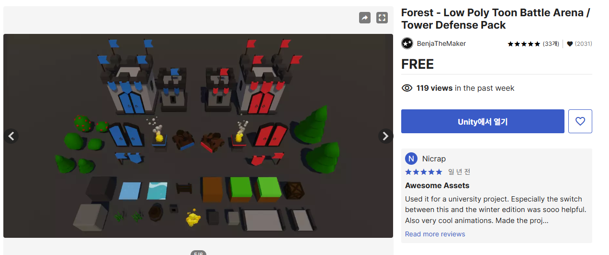
체크포인트에 사용할 깃발의 에셋이다.
(https://assetstore.unity.com/packages/3d/environments/forest-low-poly-toon-battle-arena-tower-defense-pack-100080)

- 기믹에 사용할 자동차
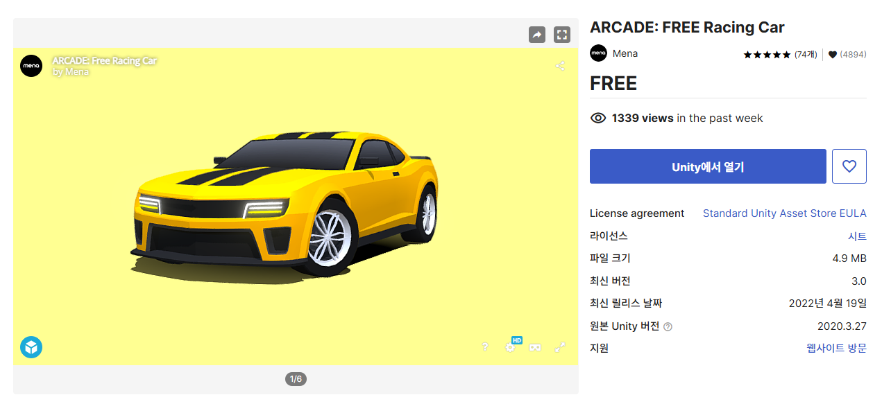
기믹에 사용할 자동차의 에셋이다.
(https://assetstore.unity.com/packages/3d/vehicles/land/arcade-free-racing-car-161085)

- 맵의 일부를 담당할 도로
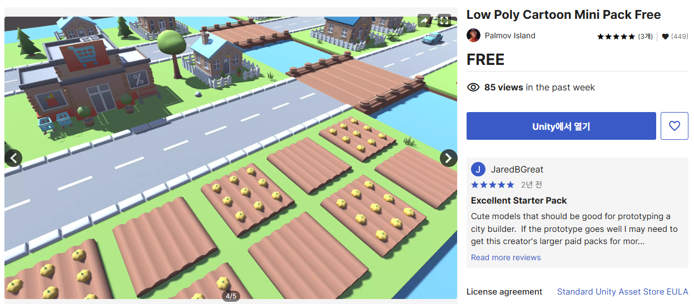
기믹의 사용할 자동차가 다닐 도로이다.
(https://assetstore.unity.com/packages/3d/environments/landscapes/low-poly-cartoon-mini-pack-free-227405)

# 2026-01-28

## 체크포인트 저장 및 리스폰
- 체크포인트는 확인할 수 있어야하기 때문에 이펙트나 애니메이션을 제외하면 오브젝트의 변화가 있어야한다. 나의 경우에는 체크포인트 저장 전에는 빨간 깃발이지만 저장하면 파란 깃발로 변하게 된다.
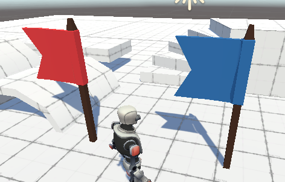
- 체크포인트는 ```Player```라는 태그를 가진 오브젝트가 닿으면 저장되게 제작했다.
- 오브젝트가 많아지면 프레임드랍이나 렉을 유발할 가능성이 있으니 조금이라도 줄이기 위해서 깃발을 바꿀땐 원래 있던 깃발을 디스트로이 까지 해준다.
- 왼쪽에는 저장하기 전에 깃발 오른쪽에는 저장 후의 깃발이 된다.

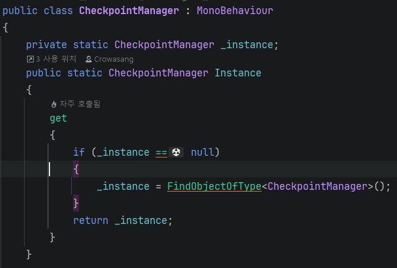
- 체크포인트 매니저로 체크포인트 저장 및 리스폰의 사용될 코드를 싱글톤패턴으로 제작한다.
- 나중에 리스폰할때 마지막으로 저장한 체크포인트의 위치값을 가져와 다시 리스폰한다.
- R키를 입력하면 마지막으로 저장한 체크포인트에서 리스폰을 할 수 있게 제작하였다.
- 이렇게 하면 나중에 죽거나 혹은 장애물에 닿으면 체크포인트로 가야할 기믹이 있을 때 다시 재사용하기 쉽도록 제작하였다.

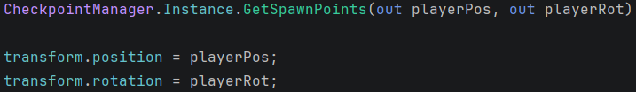
- 체크포인트매니저에서 ```GetSpawnPoints```함수에서 가져온 마지막에 저장한 체크포인트 깃발의 좌표값을 다시 ```transform```의 대입하면 리스폰이 된다.
- 그리고 혹시 모를 이동속도가 빨라지는 구간이거나 뭔가 떨어지거나 하는 기믹 때문에 속도값이 변경될 점을 우려해 ```RigidBody```의 Velocity도 초기화 시킨다.

## 캐릭터 UI기능
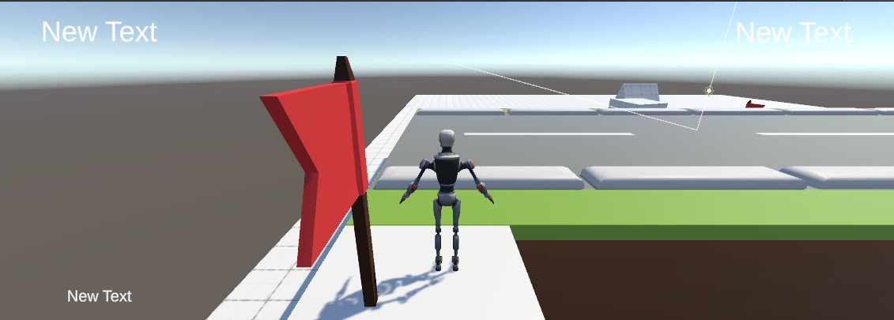
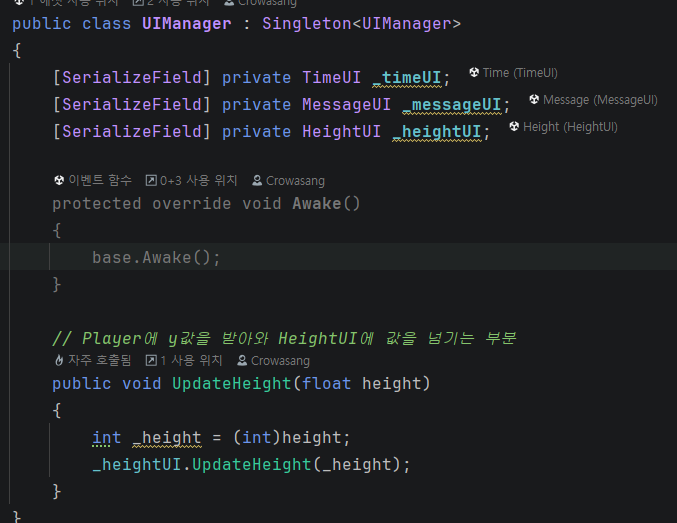
- UI는 플레이 하는 도중에 사용자에게 편리한 사항이나 각종 정보들을 표시해야 한다.
- 이것도 마찬가지로 ```UIManager```를 통해서 각각 필요한 UI들을 관리한다.

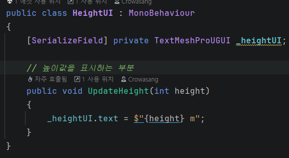
- ```HeightUI```를 사용해서 화면에 왼쪽 상단에 지금 플레이어가 어떤 높이인지 표시해준다.
- ```transform.position.y```를 통해서 플레이어의 y의 좌표값을 받아와 화면에 나타내주면 된다.
- 하지만 저렇게만 받으면 float값이 받아와지기 때문에 ```(int)```로 형변환을 하여 정수값으로 표시해주면 된다.

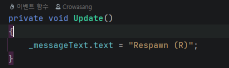
- ```MessageUI```를 사용하여 화면 왼쪽 하단에 플레이어가 필요한 정보를 전달한다.
- 지금은 간단하게 구현만을 위해서 ```리스폰 : (R)```만 표시해줬지만 나중에 필요한 정보가 있다면 더 넣을 것이다.

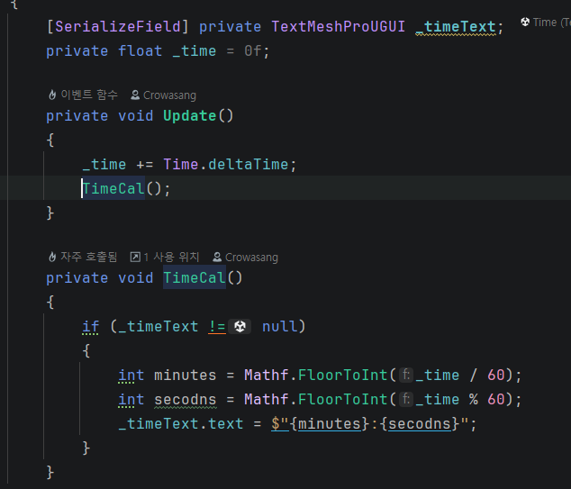
- 다음은```TimeUI```를 사용해 화면 오른쪽 상단에 플레이한 시간을 표시해준다.
- ```Time.deltaTime```를 써서 현재 시간값을 넣어주고 ```Mathf.FloorToInt```를 사용해 분과 초를 변수에 담는다.

## 차량 스폰 및 이동기능
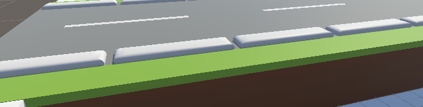
- 플레이어가 이렇게 도로가에 들어가게 되면 차량이 스폰되는 기능이다.
- 차의 이동속도는 차마다 다르며 차가 재생성되는 시간도 차마다 다르게 해놓았다.
- 재생성 시간은 얼마전에 배운 코루틴을 사용하여 트리거에 들어가면 코루틴이 시작되게 해놓았다.

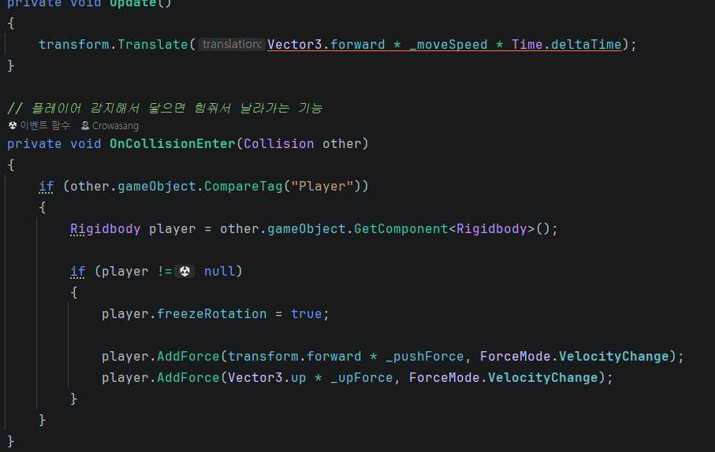
- 이렇게 차량오브젝트의 이동을 구현했고 스폰만 하면 이동되게 구현해놓았다.

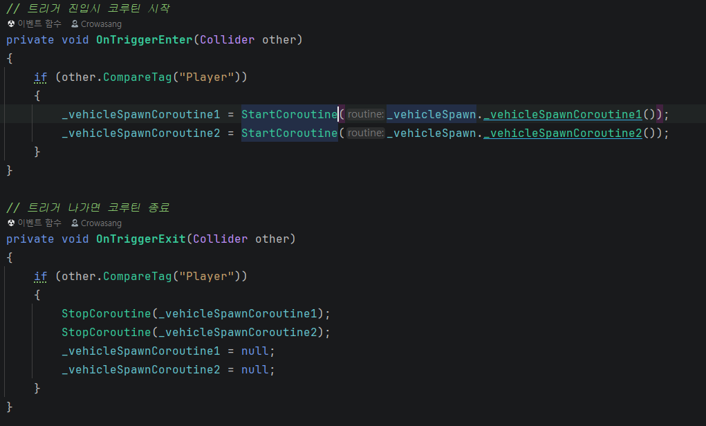
- 트리거를 사용하여 플레이어가 트리거 진입시 코루틴이 시작되도록 제작하였다.

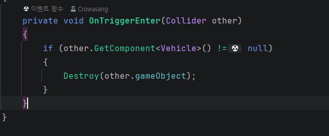
- 차량이 맵(도로)밖을 나가면 차가 사라지게 할려고 했는데 처음에는 시간을 계산하여 하였지만 이것도 계산이 어려워 그냥 트리거를 사용하여 사라지게 제작하였다.

# 2026-01-29
- 볼륨을 좀 높게 안잡았기 때문에 플레이타임 30분 안쪽으로 클리어할 수 있게 체크포인트를 적당한 곳에 두며 크게 4레벨정도로 나누었다.
- 1레벨은 특정 기믹 없이 피지컬로만 올라갈 수 있게 설계 하였다.
- 2레벨 부터 기믹이 조금씩 나오며, 움직이는 장판 회전 장판 등등 여기까지도 어느정도 피지컬쪽으로 올라갈 수 있게 하였다.
- 3레벨은 기믹이 좀 많이 나오며, 트리거를 사용하여 차가 지나가는 땅, 투명바닥 등등
- 4레벨은 환경기믹 위주로 나온다. 안개, 낙하 오브젝트 등등

# 2026-01-30
- 맵 마무리
- 타이틀 씬 추가```SceneManager```로 씬들을 관리하고 유니티엔진의 ```SceneManager```로 씬전환을 하는 ```SceneLoader```스크립트를 사용한다.
- 빈 오브젝트의 ```SceneManager```스크립트를 추가하여 각각의 씬전환을 한다.
- 메뉴씬에서 ```SceneLoader```스크립트와 오브젝트를 추가해 버튼을 클릭하면 씬전환을 한다.
- ```Switch```문을 사용하였지만 지금은 씬이 하나뿐이라서 하나의 ```case```만 주었다.
- 버튼을 클릭하면 버튼의 문자열이 ```ConvertScene```으로 들어가서 일치하는 문자열의 ```case```문으로 들어가게 하였다.
- 나중에 추가로 씬이 들어가거나 하면 버튼을 클릭하면 문자열이 들어가게 하여 똑같이 ```case```문만 사용하게 하면 되게 만들어 놓았다.

# 2026-02-02
- 팀원분들의 기믹 프리펩들을 조립하여 플레이어가 이동가능한지 버그는 없는지 등등 확인.
- 맵 테스트

# 2026-02-03
- 맵 테스트 마무리 및 기믹들 영상 녹화
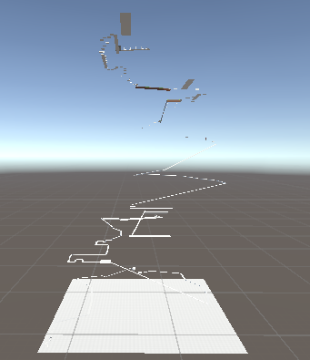
- 스카이박스를 제외한 맵디자인은 이렇게 만들었다.
- 마지막에 회전하면서 유저를 날리는 기믹과 마지막 골인지점까지 가는 문을 통과하기 위해선 오른쪽의 공모양 열쇠를 먹고 문에 닿아야지만 문이 열린다.