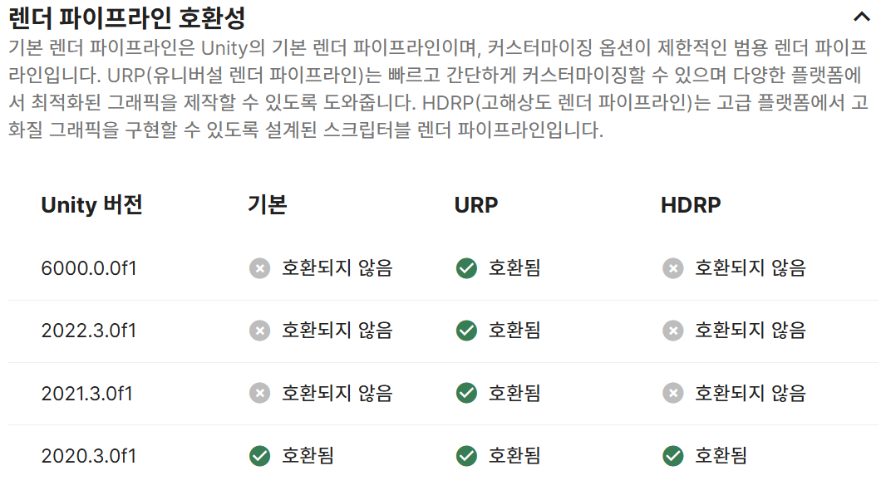
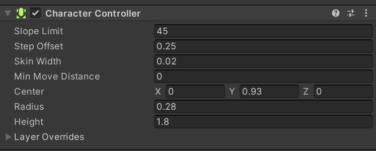
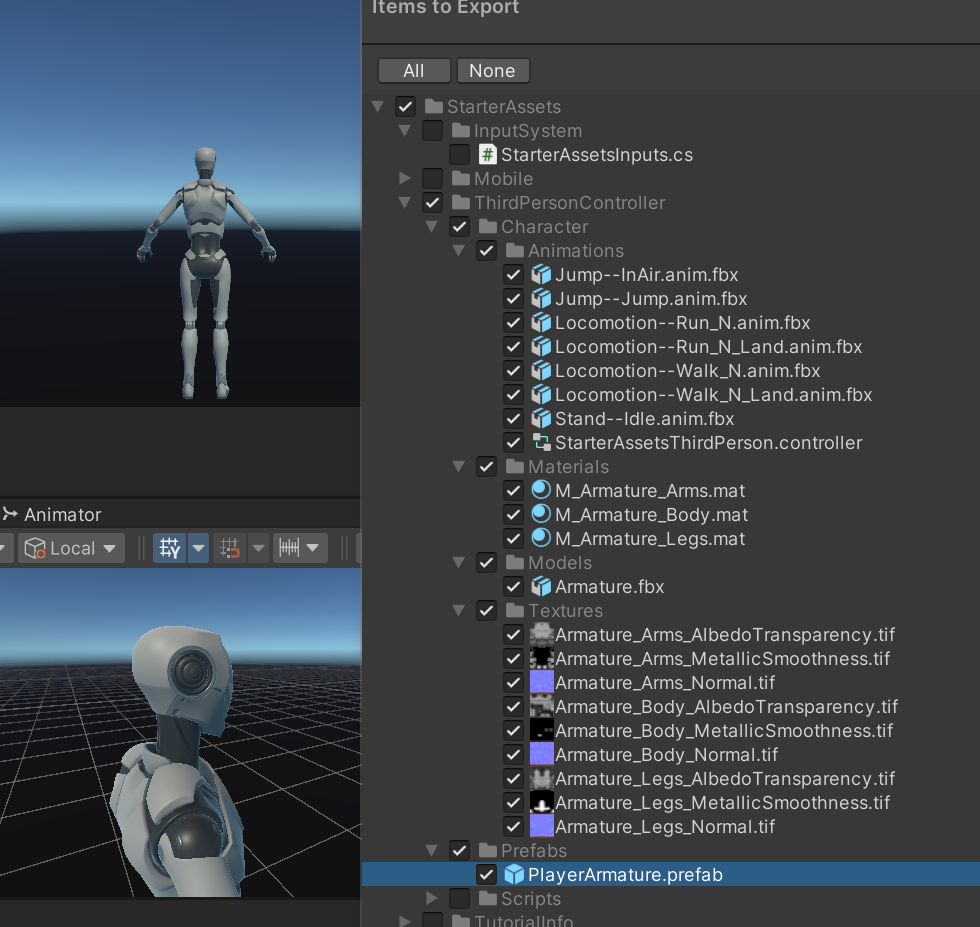
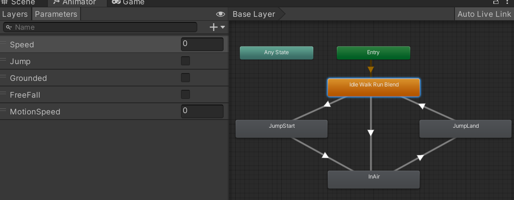
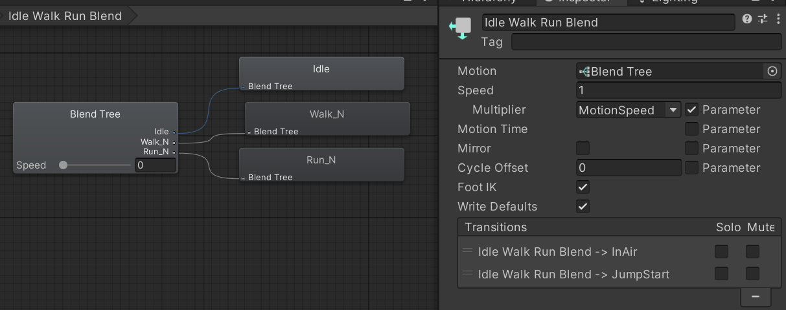
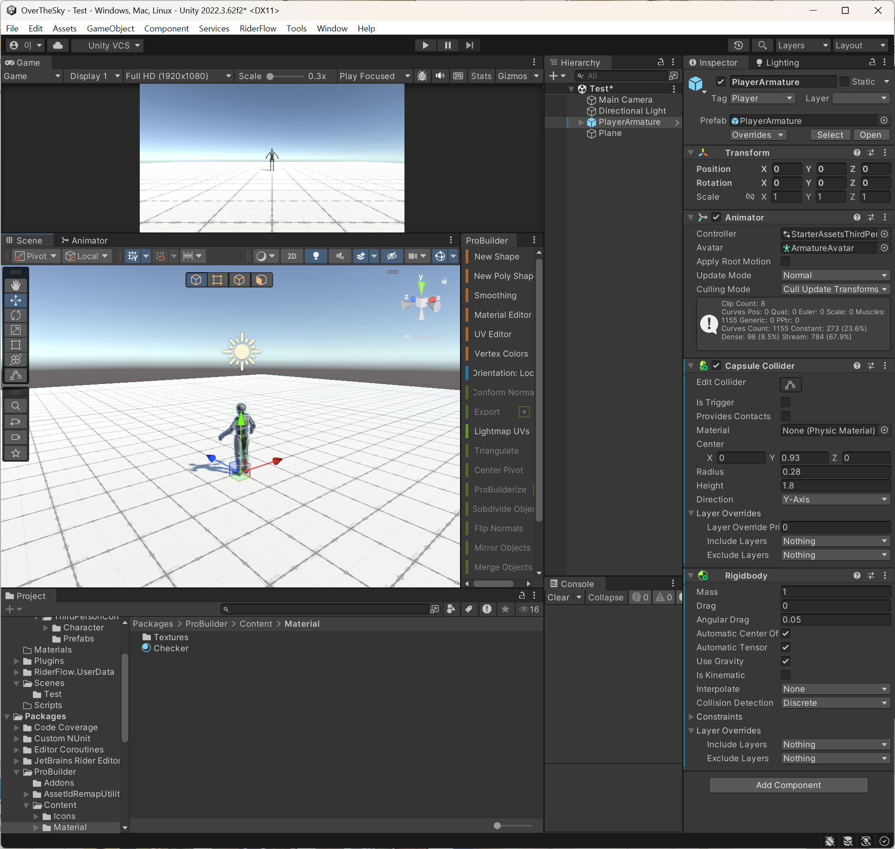
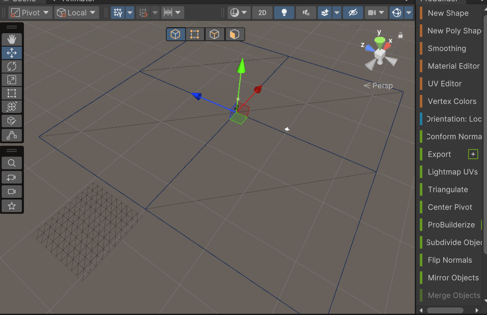
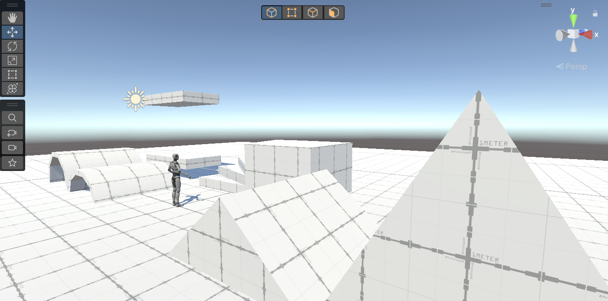
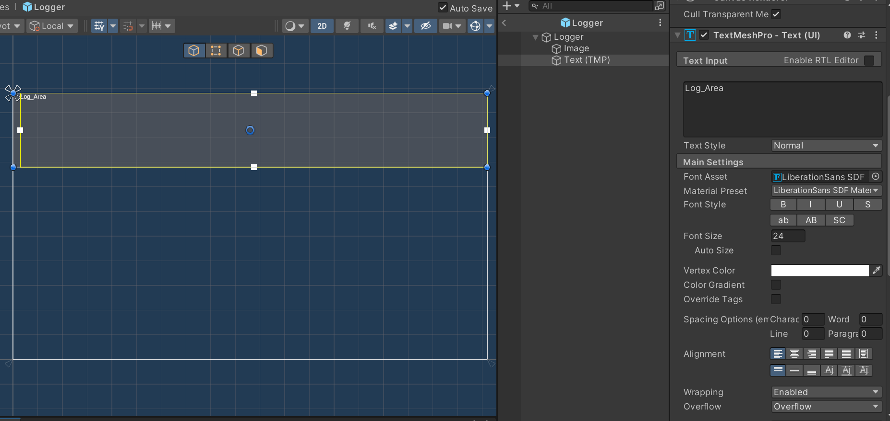
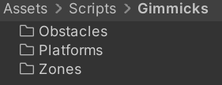

# OverTheSky_작업 노트
작업자: 이성규

게임명: OverTheSky

## 프로젝트 개요

- **진행 기간**: 7일
- **개발 환경**: Unity / C#
- **유니티 버전**: 2022.3.62f2
- **프로젝트 목표**
  - 온리 업 장르의 게임을 개발한다.
  - 프로토타이핑을 통해 최대한 빨리 개발하는 것을 목표로 함.
  - 진행 기간 전 프로젝트 팀장으로써 빠른 개발을 위한 프레임워크 개발을 진행 전주 주말에 진행.
  - 개별 작업 노트를 작성을 통해 추후 문서화 및 소통의 효율성을 높인다.
  - 에셋의 선정에 신경을 쓰기보단 구현을 최우선 사항으로 삼음.

## 작업 노트

### 2026-01-24

#### 캐릭터 시점 결정
온리업(등산) 계열의 게임은 캐릭터를 1인칭 보다는 3인칭으로 보아야 장르 특성 및 특유의 플레이 감각을 살리기에 적절하다.
- 캐릭터의 전신과 주변 환경을 동시에 보여줌으로써, 현재 위치의 높은 높이와 입체적인 지형지물을 직관적으로 인지할 수 있다.
- 발판의 끝부분이나 정확한 착지 지점을 캐릭터의 움직임과 함께 확인할 수 있어, 높은 집중력을 요구하는 정밀한 점프 액션을 수행하기에 유리하다.
- 실수로 떨어질 때 캐릭터가 허공으로 추락하는 모습을 시각적으로 직접 노출함으로써, 이 장르 특유의 좌절감과 긴장감이라는 감정적 경험을 더욱 깊게 전달한다.

#### 3D 캐릭터 선정
개발 기간의 특성상 래그돌이나 세밀한 애니메이션 연출은 힘들다. 하지만 3인칭 게임의 특성상 비주얼적으로 심플하며 적당한 모델이 필요하다 생각했다.
따라서 무료 제공 에셋 중에 유니티에서 제공하는 `Starter Assets - ThirdPerson`에셋을 사용했다.


유니티 공식에서 제공하는 패키지며 모델이 심플하고 계층구조나 제공되는 애니메이터와 애니메이션 구조가 훌륭하다.
다만 시네머신이나 제공되는 스크립트등이 붙어있어 스스로 구현하는 것이 아닌 에셋에 의존하게 되므로 모델링과 애니메이터, 애니메이션만을 가져온다. 

[AssetStore - Starter Assets - ThirdPerson](https://assetstore.unity.com/packages/essentials/starter-assets-thirdperson-updates-in-new-charactercontroller-pa-196526)

#### 3D 캐릭터 가져오는 작업
우선 본격적으로 작업할 프로젝트가 아닌 임시로 가져오기 위한 프로젝트를 만들어서 에셋을 임포트 한다.



파이프라인 호환성이 맞지 않지만 머티리얼만 변경해주면 되기에 문제 없다.

새프로젝트에 시네머신과 인풋시스템, URP 등의 패키지 설치 및 업그레이드를 요구하지만 스킵한다.

필요한것은 캐릭터 뿐이기에 샘플씬에서 플레이어의 머티리얼만 스탠다드로 변경해준다.

플레이어 프리팹에 붙어있는 스크립트를 전부 제거해준다.


캐릭터 컨트롤러 컴포넌트도 학습진도상 사용하지 않는다. 사용한다면 개발 시간도 줄어들고 편리하겠지만 일단 제거하고 스크립트로 구현한다.



이와같이 스크립트는 모두 배제한체 애니메이션과 애니메이터, 머티리얼, 모델링등의 필요한 파일만 패키지로 익스포트 한다.

 그리고 다시 프레임워크 제작 및 개발을 진행할 프로젝트를 생성한다.

 패키지를 임포트한다.

#### 캐릭터 에셋 애니메이터 구조 분석


Speed, Jump, Grounded, FreeFall, MotionSpeed 5가지 변수를 통해 컨트롤 하는 구조다.


우선 기본인 `Idle Walk Run Blend` 상태에서는 Speed 파라미터를 통해서 재생하는 애니메이션을 변경하는 것을 블랜트 트리로 구현하고 있다. 또한 `MotionSpeed` 변수를 애니메이션 재생 스피드에 곱해줘서 `Idle Walk Run Blend`상태의 애니메이션 재생 속도를 컨트롤 해줄 수 있다.

그리고 jump 파라미터를 통해 점프 상태가 되면 `jump start` 상태의 애니메이션을 재생하고 `InAir` 상태로 진입하며 Grounded 파라미터를 통해 땅에 닿았음을 전해주면 `JumpLand` 상태로 전환되며 애니메이션을 재생하고 다시 통상의 `Idle Walk Run Blend` 상태로 전환해 서있거나 걷거나 달리는 애니메이션을 재생할 수 있다.

또한 FreeFall 파라미터를 통해 그냥 걷거나 달리다 떨어질때도 FreeFall 파라미터를 통해 `IsAir` 상태에서 다시 땅에 착륙하고 걷는 과정을 재생할 수 있다.

#### 기본 세팅 및 에셋

##### 편의성 플러그인 설치

**RiderFlow**
- 에디터상에서 쉽게 코드를 보거나 수정할 수 있다.
- 쉽게 에셋을 검색해 맵 상에 배치할 수 있다.
- 게임 오브젝트 북마크로 쉽게 오브젝트를 찾을 수 있다.
- 씬뷰 카메라 시점을 저장해두고 편하게 씬뷰를 변경할 수 있다.
- 하이어라키 커스텀이나 메모등을 남겨둘 수 있다.

[[ AssetStore-RiderFlow ]](https://assetstore.unity.com/packages/tools/level-design/riderflow-218574?locale=ko-KR&srsltid=AfmBOopfpDas0VOG9BZpZUti8Bt4dKOoAT_jWbs3Mk3szN50XD26S4OO)

**SnapToFlow**
- 공중에 있는 게임오브젝트를 선택하고 End키를 누르면 땅 스냅되서 붙는다.
- 오브젝트 배치시 편의성을 위해서 사용

[[ AssetStore-SnapToFloor ]](https://assetstore.unity.com/packages/tools/level-design/snaptofloor-220851)

##### 기타 에셋
**Prototype Map**
프로토타입 맵을 위해서 사용함.
프로토타입 마티리얼 및 간단히 맵 배치를 위해서 사용
- 에셋을 깔아서 살펴보니 완성된 맵이 존재해서 쓸만하진 않고 마티리얼만 사용.

[[ AssetStore-Prototype Map ]](https://assetstore.unity.com/packages/3d/environments/prototype-map-315588)

##### 유니티 패키지
**ProBuilder**
프로토 타이핑용도로 간단히 여러 도형을 배치하기 위해 설치.

**Recorder**
인게임 스크린샷 및 녹화를 위해서 설치

**TextMeshPro**
UI 표시용으로 필수 설치

**Post Processing**
비주얼을 잡아주기 위한 후보정 작업용.  
팀장 전담 작업 예정.  
기본적으로는 톤 보정으로 가볍게 잡아줄 생각.

#### 기본 배치
- 우선 개발을 위한 Test 씬 생성
- 미리 가져온 플레이어를 배치
- plane으로 바닥배치



- 충돌을 계산하는데 있어 중요할 Capsule 콜라이더 및 Rigdbody를 캐릭터에 추가.
- plane 메쉬 콜라이더 삭제하고 Box 콜라이더 추가로 충돌 계산 성능 최적화.
  - 충돌을 안정적으로 하기 위해 아래로 콜라이더 두께를 늘릴 수 도 있음


프로 빌더로 생성한 plane이 폴리곤 수도 적고 최적화에 좋음.

프로토타이핑 및 메쉬 편집, 성능 등 차원에서 이점이 크므로 기본 도형 생성시 애용함.
Auto UV로 타일링 작업 시간도 줄음.



프로토 타입 제작용 도형 배치 완료

#### 프로젝트 가이드 문서 작성

개발에 있어 가이드가 될 문서 작업.

---

### 2026-01-25

#### 역할 분담 문서 작성

- 역할 분담 및 구현 예시 사항등을 적은 문서를 작성
- 작업 규칙 표기, 목표 사항 및 선택 구현 표기

#### 깃허브 백업

깃허브에 프로젝트 파일 및 문서 백업

private으로 생성, 추후 콜라보레이션으로 작업 멤버로 팀원 초대

README.md에 작성한 가이드문서 내용 복붙.  
깃허브 페이지에서 쉽게 가이드 문서 보면서 작업 가능

#### 코어 스크립트 작성
우선 스크립트 폴더에 코어가 될 스크립트들을 작성하기 위한 Core 폴더를 생성한다.

#### 싱글톤
Core 폴더 안에 Singletons 폴더를 만들고, 프로젝트 전반에서 매니저 클래스들이 공통으로 사용할 제네릭 싱글톤 스크립트를 작성했다.

**싱글톤 스크립트 작성**
- `_applicationIsQuitting` 체크
  - 일반적으로 실행 종료시에 싱글톤은 파괴되지만 파괴되는 순서는 랜덤이므로 그 사이에 다른 오브젝트에서 싱글턴에 접근해 싱글톤이 다시 생성되는 것을 방지하기 위해 씬이 빠져나가는지 체크할 변수를 추가했다.
- `FindFirstObjectByType<T>()` 최적화
  - 첫 번째로 발견된 객체를 가져오는 FindFirstObjectByType을 사용하여 성능을 최적화
  - 싱글톤 특성상 씬에 하나만 존재하므로 `첫 번째`만 찾는 동작이 적합하다.
- Awake를 virtual로 선언하여 사용
  - 상속받는 매니저 클래스에서 override 시 반드시 base.Awake()를 호출할 필요가 있음.
  - base.Awake() 내부에서 **DontDestroyOnLoad**가 실행되므로, 이를 누락할 경우 씬 전환 시 매니저가 삭제되는 문제가 발생함.
  ```cs
  protected override void Awake()
  {
    base.Awake(); // 필수 호출
    // ... 초기화 로직
  }
  ```
- **디버깅 및 편의성 기능**
   - 런타임 생성 시 `[Singleton] ClassName`으로 네이밍하여 하이어라키 가시성 확보.
   - 씬에 중복 배치된 매니저가 있을 경우 경고 로그 출력 후 자동 삭제.

#### 개발 편의성을 위한 인게임 로그창 개발

- 개발 사유  
https://youtu.be/0USXRC9f4Iw?si=bAmTEeBBeiI8qeQg
상기 영상에서 사용하는 Log창을 보고 좋다고 생각하여 구현함.
구현된 로그 클래스의 인스턴스를 통해 다른 스크립트에서도 쉽게 인게임 상으로 로그를 출력해볼 수 있다.

- 로그창 제작

- Canvas와 TMP를 활용한 오버레이 형태의 프리팹 제작.
- 배경을 투명/반투명 처리하여 게임 플레이를 가리지 않도록 배치.

- `Logger` 스크립트 작성
  - 해당 프리팹에 로그를 출력해줄 스크립트를 작성함.
  - Queue<string>을 활용해 로그 텍스트 선입 선출로 자연스럽게 최대 라인 수가 있는 로그창을 연출함
  - 최종 출력 시 string.Join을 사용하여 UI 텍스트 갱신
  - Debug.isDebugBuild를 통해 릴리즈 빌드에선 동작 안하게 방지 처리
  - #if UNITY_EDITOR 와 OnValidate를 사용해 에디터 상태에서 인스펙터의 enableDebug 체크박스를 통해 텍스트 표시 여부를 제어하는 편의성 확보
  - 로그 타입별 색상 구분
    - (Info: 초록, Warning: 노랑, Error: 빨강)
  - DateTime을 활용한 로그의 타임스탬프 표시.

---

### 2026-01-26

#### 회의 및 가이드 문서 수정
강의에 따라 가이드 문서 추가 수정 및 팀원에게 문서 공유<br>
문서를 보며 제작방향 회의 및 정보 전달

#### 프로젝트 역할 분담 완료
회의를 통해 각 팀원의 역할을 분담

#### 작업노트에 있던 R&D 문서 별도 분리.
이 문서에 있던 R&D 섹션 제거 후 별도 문서로 분리해 R&D 문서로 작성

### 2026-01-27

#### 네임스페이스 수정
업데이트한 네임 스페이스 명명 규칙에 따라 기존 코드 수정

#### 베이스 코드 작성

<br>
우선 기믹 스크립트 폴더 세분화
- 플랫폼, 장애물, 영역 효과(Zone) 등으로 분리.

**PlatformBase(이동 발판) 추상화 클래스 작성**
- **구현 방식**: `MonoBehaviour` 대신 상속받아 사용할 추상 클래스 `PlatformBase` 구현.
- **물리 이동 처리 (FixedUpdate)**:
  - `transform.position` 대신 `Rigidbody.MovePosition`을 채택하여 이동 시 플레이어가 발판을 뚫고 떨어지는 현상 방지.
  - 자식 클래스는 `CalculateNextPosition()`만 구현하면 되도록 복잡한 물리 로직은 부모 클래스에 캡슐화.
- **속도 공유 시스템 (Anti-Slip)**:
  - `CurrentVelocity` 프로퍼티를 통해 발판의 현재 이동 속도를 계산하여 노출.
  - 추후 플레이어 컨트롤러에서 이 값을 읽어와 플레이어 속도에 더해줌으로써, 움직이는 발판 위에서 미끄러지는 현상 해결 예정.

---

**작성일**: 2026-01-24  
**최종 수정**: 2026-01-26