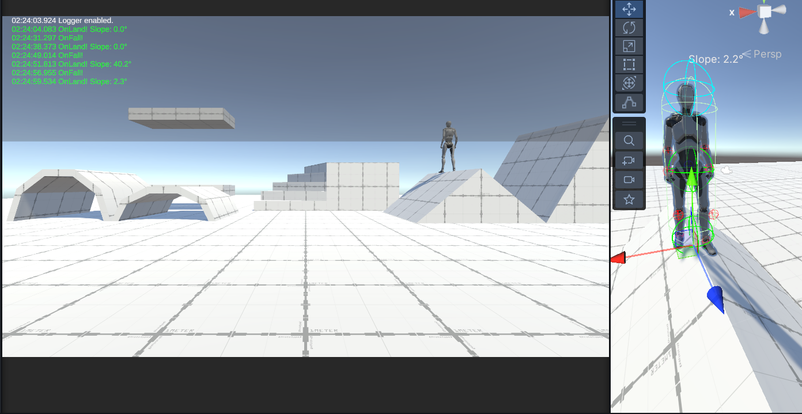
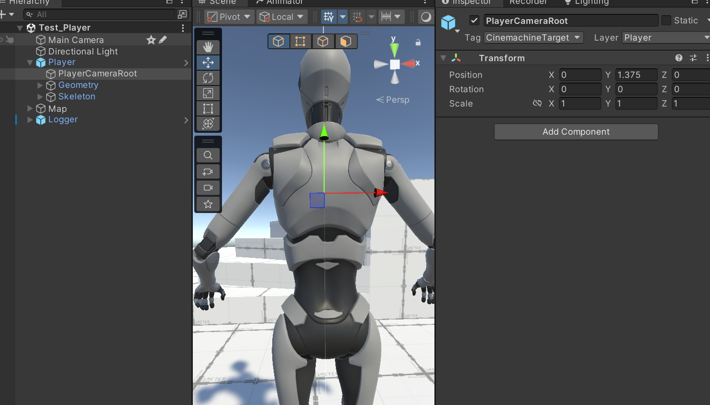
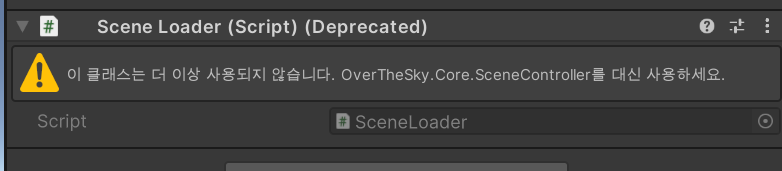

# OverTheSky_작업 노트
작업자: 이성규

게임명: OverTheSky

## 프로젝트 개요

- **진행 기간**: 7일
- **개발 환경**: Unity / C#
- **유니티 버전**: 2022.3.62f2
- **프로젝트 목표**
  - 온리 업 장르의 게임을 개발한다.
  - 프로토타이핑을 통해 최대한 빨리 개발하는 것을 목표로 함.
  - 진행 기간 전 프로젝트 팀장으로써 빠른 개발을 위한 프레임워크 개발을 진행 전주 주말에 진행.
  - 개별 작업 노트를 작성을 통해 추후 문서화 및 소통의 효율성을 높인다.
  - 에셋의 선정에 신경을 쓰기보단 구현을 최우선 사항으로 삼음.

## 작업 노트

### 2026-01-24

#### 캐릭터 시점 결정
온리업(등산) 계열의 게임은 캐릭터를 1인칭 보다는 3인칭으로 보아야 장르 특성 및 특유의 플레이 감각을 살리기에 적절하다.
- 캐릭터의 전신과 주변 환경을 동시에 보여줌으로써, 현재 위치의 높은 높이와 입체적인 지형지물을 직관적으로 인지할 수 있다.
- 발판의 끝부분이나 정확한 착지 지점을 캐릭터의 움직임과 함께 확인할 수 있어, 높은 집중력을 요구하는 정밀한 점프 액션을 수행하기에 유리하다.
- 실수로 떨어질 때 캐릭터가 허공으로 추락하는 모습을 시각적으로 직접 노출함으로써, 이 장르 특유의 좌절감과 긴장감이라는 감정적 경험을 더욱 깊게 전달한다.

#### 3D 캐릭터 선정
개발 기간의 특성상 래그돌이나 세밀한 애니메이션 연출은 힘들다. 하지만 3인칭 게임의 특성상 비주얼적으로 심플하며 적당한 모델이 필요하다 생각했다.
따라서 무료 제공 에셋 중에 유니티에서 제공하는 `Starter Assets - ThirdPerson`에셋을 사용했다.


유니티 공식에서 제공하는 패키지며 모델이 심플하고 계층구조나 제공되는 애니메이터와 애니메이션 구조가 훌륭하다.
다만 시네머신이나 제공되는 스크립트등이 붙어있어 스스로 구현하는 것이 아닌 에셋에 의존하게 되므로 모델링과 애니메이터, 애니메이션만을 가져온다. 

[AssetStore - Starter Assets - ThirdPerson](https://assetstore.unity.com/packages/essentials/starter-assets-thirdperson-updates-in-new-charactercontroller-pa-196526)

#### 3D 캐릭터 가져오는 작업
우선 본격적으로 작업할 프로젝트가 아닌 임시로 가져오기 위한 프로젝트를 만들어서 에셋을 임포트 한다.


파이프라인 호환성이 맞지 않지만 머티리얼만 변경해주면 되기에 문제 없다.

새프로젝트에 시네머신과 인풋시스템, URP 등의 패키지 설치 및 업그레이드를 요구하지만 스킵한다.

필요한것은 캐릭터 뿐이기에 샘플씬에서 플레이어의 머티리얼만 스탠다드로 변경해준다.

플레이어 프리팹에 붙어있는 스크립트를 전부 제거해준다.


캐릭터 컨트롤러 컴포넌트도 학습진도상 사용하지 않는다. 사용한다면 개발 시간도 줄어들고 편리하겠지만 일단 제거하고 스크립트로 구현한다.


이와같이 스크립트는 모두 배제한체 애니메이션과 애니메이터, 머티리얼, 모델링등의 필요한 파일만 패키지로 익스포트 한다.

 그리고 다시 프레임워크 제작 및 개발을 진행할 프로젝트를 생성한다.

 패키지를 임포트한다.

#### 캐릭터 에셋 애니메이터 구조 분석


Speed, Jump, Grounded, FreeFall, MotionSpeed 5가지 변수를 통해 컨트롤 하는 구조다.


우선 기본인 `Idle Walk Run Blend` 상태에서는 Speed 파라미터를 통해서 재생하는 애니메이션을 변경하는 것을 블랜트 트리로 구현하고 있다. 또한 `MotionSpeed` 변수를 애니메이션 재생 스피드에 곱해줘서 `Idle Walk Run Blend`상태의 애니메이션 재생 속도를 컨트롤 해줄 수 있다.

그리고 jump 파라미터를 통해 점프 상태가 되면 `jump start` 상태의 애니메이션을 재생하고 `InAir` 상태로 진입하며 Grounded 파라미터를 통해 땅에 닿았음을 전해주면 `JumpLand` 상태로 전환되며 애니메이션을 재생하고 다시 통상의 `Idle Walk Run Blend` 상태로 전환해 서있거나 걷거나 달리는 애니메이션을 재생할 수 있다.

또한 FreeFall 파라미터를 통해 그냥 걷거나 달리다 떨어질때도 FreeFall 파라미터를 통해 `IsAir` 상태에서 다시 땅에 착륙하고 걷는 과정을 재생할 수 있다.

#### 기본 세팅 및 에셋

##### 편의성 플러그인 설치

**RiderFlow**
- 에디터상에서 쉽게 코드를 보거나 수정할 수 있다.
- 쉽게 에셋을 검색해 맵 상에 배치할 수 있다.
- 게임 오브젝트 북마크로 쉽게 오브젝트를 찾을 수 있다.
- 씬뷰 카메라 시점을 저장해두고 편하게 씬뷰를 변경할 수 있다.
- 하이어라키 커스텀이나 메모등을 남겨둘 수 있다.

[[ AssetStore-RiderFlow ]](https://assetstore.unity.com/packages/tools/level-design/riderflow-218574?locale=ko-KR&srsltid=AfmBOopfpDas0VOG9BZpZUti8Bt4dKOoAT_jWbs3Mk3szN50XD26S4OO)

**SnapToFlow**
- 공중에 있는 게임오브젝트를 선택하고 End키를 누르면 땅 스냅되서 붙는다.
- 오브젝트 배치시 편의성을 위해서 사용

[[ AssetStore-SnapToFloor ]](https://assetstore.unity.com/packages/tools/level-design/snaptofloor-220851)

##### 기타 에셋
**Prototype Map**
프로토타입 맵을 위해서 사용함.
프로토타입 마티리얼 및 간단히 맵 배치를 위해서 사용
- 에셋을 깔아서 살펴보니 완성된 맵이 존재해서 쓸만하진 않고 마티리얼만 사용.

[[ AssetStore-Prototype Map ]](https://assetstore.unity.com/packages/3d/environments/prototype-map-315588)

##### 유니티 패키지
**ProBuilder**
프로토 타이핑용도로 간단히 여러 도형을 배치하기 위해 설치.

**Recorder**
인게임 스크린샷 및 녹화를 위해서 설치

**TextMeshPro**
UI 표시용으로 필수 설치

**Post Processing**
비주얼을 잡아주기 위한 후보정 작업용.  
팀장 전담 작업 예정.  
기본적으로는 톤 보정으로 가볍게 잡아줄 생각.

#### 기본 배치
- 우선 개발을 위한 Test 씬 생성
- 미리 가져온 플레이어를 배치
- plane으로 바닥배치


- 충돌을 계산하는데 있어 중요할 Capsule 콜라이더 및 Rigdbody를 캐릭터에 추가.
- plane 메쉬 콜라이더 삭제하고 Box 콜라이더 추가로 충돌 계산 성능 최적화.
  - 충돌을 안정적으로 하기 위해 아래로 콜라이더 두께를 늘릴 수 도 있음


프로 빌더로 생성한 plane이 폴리곤 수도 적고 최적화에 좋음.

프로토타이핑 및 메쉬 편집, 성능 등 차원에서 이점이 크므로 기본 도형 생성시 애용함.
Auto UV로 타일링 작업 시간도 줄음.


프로토 타입 제작용 도형 배치 완료

#### 프로젝트 가이드 문서 작성

개발에 있어 가이드가 될 문서 작업.

---

### 2026-01-25

#### 역할 분담 문서 작성

- 역할 분담 및 구현 예시 사항등을 적은 문서를 작성
- 작업 규칙 표기, 목표 사항 및 선택 구현 표기

#### 깃허브 백업

깃허브에 프로젝트 파일 및 문서 백업

private으로 생성, 추후 콜라보레이션으로 작업 멤버로 팀원 초대

README.md에 작성한 가이드문서 내용 복붙.  
깃허브 페이지에서 쉽게 가이드 문서 보면서 작업 가능

#### 코어 스크립트 작성
우선 스크립트 폴더에 코어가 될 스크립트들을 작성하기 위한 Core 폴더를 생성한다.

#### 싱글톤
Core 폴더 안에 Singletons 폴더를 만들고, 프로젝트 전반에서 매니저 클래스들이 공통으로 사용할 제네릭 싱글톤 스크립트를 작성했다.

**싱글톤 스크립트 작성**
- `_applicationIsQuitting` 체크
  - 일반적으로 실행 종료시에 싱글톤은 파괴되지만 파괴되는 순서는 랜덤이므로 그 사이에 다른 오브젝트에서 싱글턴에 접근해 싱글톤이 다시 생성되는 것을 방지하기 위해 씬이 빠져나가는지 체크할 변수를 추가했다.
- `FindFirstObjectByType<T>()` 최적화
  - 첫 번째로 발견된 객체를 가져오는 FindFirstObjectByType을 사용하여 성능을 최적화
  - 싱글톤 특성상 씬에 하나만 존재하므로 `첫 번째`만 찾는 동작이 적합하다.
- Awake를 virtual로 선언하여 사용
  - 상속받는 매니저 클래스에서 override 시 반드시 base.Awake()를 호출할 필요가 있음.
  - base.Awake() 내부에서 **DontDestroyOnLoad**가 실행되므로, 이를 누락할 경우 씬 전환 시 매니저가 삭제되는 문제가 발생함.
  ```cs
  protected override void Awake()
  {
    base.Awake(); // 필수 호출
    // ... 초기화 로직
  }
  ```
- **디버깅 및 편의성 기능**
   - 런타임 생성 시 `[Singleton] ClassName`으로 네이밍하여 하이어라키 가시성 확보.
   - 씬에 중복 배치된 매니저가 있을 경우 경고 로그 출력 후 자동 삭제.

#### 개발 편의성을 위한 인게임 로그창 개발

- 개발 사유  
https://youtu.be/0USXRC9f4Iw?si=bAmTEeBBeiI8qeQg
상기 영상에서 사용하는 Log창을 보고 좋다고 생각하여 구현함.
구현된 로그 클래스의 인스턴스를 통해 다른 스크립트에서도 쉽게 인게임 상으로 로그를 출력해볼 수 있다.

- 로그창 제작

- Canvas와 TMP를 활용한 오버레이 형태의 프리팹 제작.
- 배경을 투명/반투명 처리하여 게임 플레이를 가리지 않도록 배치.

- `Logger` 스크립트 작성
  - 해당 프리팹에 로그를 출력해줄 스크립트를 작성함.
  - Queue<string>을 활용해 로그 텍스트 선입 선출로 자연스럽게 최대 라인 수가 있는 로그창을 연출함
  - 최종 출력 시 string.Join을 사용하여 UI 텍스트 갱신
  - Debug.isDebugBuild를 통해 릴리즈 빌드에선 동작 안하게 방지 처리
  - #if UNITY_EDITOR 와 OnValidate를 사용해 에디터 상태에서 인스펙터의 enableDebug 체크박스를 통해 텍스트 표시 여부를 제어하는 편의성 확보
  - 로그 타입별 색상 구분
    - (Info: 초록, Warning: 노랑, Error: 빨강)
  - DateTime을 활용한 로그의 타임스탬프 표시.

---

### 2026-01-26

#### 회의 및 가이드 문서 수정
강의에 따라 가이드 문서 추가 수정 및 팀원에게 문서 공유<br>
문서를 보며 제작방향 회의 및 정보 전달

#### 프로젝트 역할 분담 완료
회의를 통해 각 팀원의 역할을 분담

#### 작업노트에 있던 R&D 문서 별도 분리.
이 문서에 있던 R&D 섹션 제거 후 별도 문서로 분리해 R&D 문서로 작성

### 2026-01-27

#### 네임스페이스 수정
업데이트한 네임 스페이스 명명 규칙에 따라 기존 코드 수정

#### 베이스 코드 작성

<br>
우선 기믹 스크립트 폴더 세분화
- 플랫폼, 장애물, 영역 효과(Zone) 등으로 분리.

**PlatformBase(이동 발판) 추상화 클래스 작성**
- **구현 방식**: `MonoBehaviour` 대신 상속받아 사용할 추상 클래스 `PlatformBase` 구현.
- **물리 이동 처리 (FixedUpdate)**:
  - `transform.position` 대신 `Rigidbody.MovePosition`을 채택하여 이동 시 플레이어가 발판을 뚫고 떨어지는 현상 방지.
  - 자식 클래스는 `CalculateNextPosition()`만 구현하면 되도록 복잡한 물리 로직은 부모 클래스에 캡슐화.
- **속도 공유 시스템 (Anti-Slip)**:
  - `CurrentVelocity` 프로퍼티를 통해 발판의 현재 이동 속도를 계산하여 노출.
  - 추후 플레이어 컨트롤러에서 이 값을 읽어와 플레이어 속도에 더해줌으로써, 움직이는 발판 위에서 미끄러지는 현상 해결 예정.

#### 프로젝트 초기 환경 구축 및 협업 툴 셋업
강사진 제공 깃허브 저장소에 기존에 작업한 문서(Docs) 및 프로젝트 파일 이동

#### 팀원 배포 및 가이드
리포지토리 URL 공유 및 초기 세팅 가이드라인 안내 완료.

#### Define 코어 스크립트 작성
- 전역적으로 사용하는 상수(Constant) 및 열거형(Enum) 정의.
- 팀원들이 기능 구현 시 쉽게 참조할 수 있도록 develop 브랜치에 선반영.


#### 협업툴 Notion 템플릿을 받아 셋업 진행
데일리 스크럼, 일정, 회고등의 기능을 활용할 수 있음.
기존 작성된 마크다운 문서를 노션 페이지에 옮겨 작성

### 2026-01-28

#### 플레이어 제작

**플레이어 물리 코어(PlayerBase) 스크립트 작성**

`PlayerController`가 상속받을 부모 클래스<br>
우선 플레이어 관련 스크립트의 기반이자 플레이어가 가져야할 정보를 가진 `PlayerBase` 스크립트를 작성한다.

필요기능
- 컴포넌트 캐싱 (References)
  - Rigidbody, Animator, CapsuleCollider 등 필수 컴포넌트를 미리 Awake에서 잡아주고 컨트롤러에서 가져다 쓰기.
  - Rigidbody 설정을 코드000에서 제어 (Interpolate, FreezeRotation, UseGravity: False 등)
- 땅 체크 로직 (Ground Check)
- 캐릭터 상태값 (State Properties)
  - IsGrounded 등의 상태 변경으로 OnLand, OnFall 등의 이벤트 발생
작업 순서
- 자식 사용을 위한 컴포넌트
- 플레이어가 붙은게 땅, 천장, 벽인지 판단 필요
- 경사로 체크용 노말 벡터 변수: 기본적으로는 `Vector3.up;`
- FixedUpdate에서 CheckGround,  CheckCeiling 함수 호출
- CheckGround 함수
  - SphereCast로 바닥 감지
  - 땅에 닿는 순간 / 떨어지는 순간 이벤트 처리용 가상함수 호출
- 씬뷰 테스트를 위한 기즈모 추가
- 바닥 판정을 개발 중 Sphere 반지름과 Cast 거리 문제로 offset 값이 작을시 바닥 판정을 못하고 구가 바닥에 닿기 전 Cast가 끝나는 문제 확인
- 정확히 플레이어 캡슐 콜라이더의 바닥 기준점 계산
- 충돌 구체 위치를 `캡슐 바닥 + 구 반지름 위치`로 잡음
- 캐스트 거리: 반지름 + 체크 오프셋

- SphereCast는 시작부터 겹쳐있으면 감지 못하는 점을 개선
  - 물리 엔진은 중력 때문에 캐릭터를 바닥 안으로 아주 살짝 파고들게 했다가, 다시 위로 밀어낸다. 이때 Sphere가 바닥 콜라이더 내부에 파묻혀 있는 순간 Physics.SphereCast는 "이미 겹쳐 있는 콜라이더"는 감지하지 못하고 무시해버린다. 그래서 땅이 없다고 판단해 Fall이 뜬다.
  - Raycast의 시작점을 몸통 중앙으로 변경하고, 탐지 거리를 (키 절반) - (반지름) + (오프셋)으로 재계산하여 내부에서부터 쏘는 방식으로 변경. 시작점이 파묻히는 문제 해결.
- 바닥에 닿는 순간 종종 OnLand 다음 OnFall이 호출되는 경우가 생김
  - 바운싱 의심
    - 디바운싱 (Debouncing) 로직 추가
    - 그라운드 체크에 시간을 둬서 바닥에 닿고 짧은 시간 이내에는 아직 바닥에 있는걸로 판정한다.
    - 코요테 타임(Coyote Time)으로 체크하여 바닥에서 떨어져도 0.1초 동안은 땅에 닿은 상태로 취급하여 판정을 완화하고. 바운싱으로 인해 땅에 있는지 여부가 편하는 것을 방지한다.
    - 즉시 떨어지지 않고 공중에 떠서 점프할 수 있을 때 까지의 시간으로도 쓸 수 있다.
- 레이 충돌을 통해 얻은 노말값을 통해 경사면 체크 및 천장 체크 추가.
- 디버깅용 기즈모 설정.
  - Ground SphereCast
    - 바닥: 녹색 / 벽: 마젠타 / 그 외: 적색
  - 시작 구 (캡슐 내부), 끝 구 (바닥 닿는 곳), 둘 사이 연결 선
  - Ceiling(천장) 체크 영역 시각화
  - Ground Normal 시각화
  - Handles.Label로 경사각 표시

**Normal 판정 임계값**
1. GROUND_NORMAL_THRESHOLD = 0.7f (바닥 판정) 이유:
   - Unity 캐릭터 컨트롤러 매뉴얼의 Slope Limit 개념과 유사.
   - 수학적 의미: 바닥의 위쪽 방향 벡터(Normal)와 캐릭터의 위쪽 방향(Vector3.up)을 내적했을 때 결과가 0.7 이상이어야 한다.각도 기준: cos^{-1}(0.7)은 약 45도. 즉, 경사도가 45도보다 완만한 곳만 바닥으로 인정하고 그보다 가파르면 '벽'으로 간주해 미끄러지게 만든다. 
2. CEILING_NORMAL_THRESHOLD = -0.1f (천장 판정) 이유:
   - 머리 위의 물체가 단순한 경사면인지, 실제 진행을 방해하는 천장인지를 구분.
   - 수학적 의미: 바닥 벡터가 아래쪽을 향할 때(음수 값), 그 값이 -0.1보다 작으면(예: -0.5, -1.0) 천장으로 판정.

### 2026-01-29

플레이어의 조작감 향상을 위한 Input System 재설계, 물리 기반 캐릭터 컨트롤러 구현, 그리고 3인칭 카메라 시스템 구축. Rigidbody의 마찰과 항력(Drag)을 제거하고, 자체적인 속도 계산 로직을 적용함.

#### InputManager 제작

플레이어의 기초 스크립트를 만들었으니 플레이어 컨트롤러를 작성하기 전 입력을 관리할 InputManager를 제작한다.

입력 로직과 캐릭터 제어 로직을 분리

싱글톤 패턴으로 전역적 접근 가능

우선 입력 값을 프로퍼티로 설정해 입력값이 들어와 값이 변할때 이벤트를 호출하게 한다.

프로퍼티 변수와 `Action`을 사용한 변화 감지형 옵저버 패턴

벡터 정규화(.normalized)를 통해 일정한 이동속도 구현

OnMove, OnJump, Sprint 이벤트를 통해 외부에서 이벤트 할당하는 방식으로 개발 가능

**입력 차단 구현**
- SetInputActive(bool) 함수를 통해 컷신, UI 팝업 등 특정 상황에서 입력을 원천 차단.
- 차단 시 이동 벡터를 Zero로 초기화하여 캐릭터가 계속 움직이는 현상 방지.

프로퍼티의 set 접근자 내부에 if (value != _currentValue) 조건을 추가로 이벤트 호출 빈도 최적화

초기에는 Action을 활용한 옵저버 패턴(값이 변할 때만 이벤트 호출)으로 설계했으나, FixedUpdate와의 동기화 및 반응성 문제를 해결하기 위해 Polling(매 프레임 확인) + Buffering 방식으로 변경함.
- 입력 버퍼(Input Buffer) 도입
  - 점프 같은 단발성 입력이 물리 연산 프레임(FixedUpdate)과 엇갈려 씹히는 현상을 방지.
  - Update에서 GetKeyDown을 감지하여 버퍼(_jumpBuffered)를 true로 만들고, FixedUpdate에서 소비(ConsumeJump)하는 방식 적용.
- 입력 차단(Input Blocking):
  - SetInputActive(bool) 함수 구현. 컷신이나 UI 팝업 시 입력을 원천 차단하고 이동 벡터를 초기화하여 캐릭터가 계속 미끄러지는 현상 방지.

#### PlayerController 구현
3인칭 게임이므로 카메라를 기준으로 이동을 구현할 필요가 있다.

Camera.main의 forward/right 벡터를 기준으로 입력값을 변환하여, 카메라가 보는 방향을 기준으로 캐릭터가 이동하도록 구현.
```cs
private Vector3 GetCameraRelativeMovement(Vector2 input)
{
    Transform cameraTransform = mainCamera.transform;
    Vector3 forward = cameraTransform.forward;
    Vector3 right = cameraTransform.right;
    
    forward.y = 0f;
    right.y = 0f;
    forward.Normalize();
    right.Normalize();
    
    return (forward * input.y + right * input.x).normalized;
}
```

Vector3.ProjectOnPlane을 사용하여 경사면에서도 속도 감소 없이 이동 방향을 유지.

문제 해결(트러블 슈팅)

- 물리엔진 고뇌
  - 땅에서 움직이지 않거나 뻑뻑함 (Friction 문제)
  - 현상: 이동 입력이 있어도 캐릭터가 제자리에서 꿈쩍하지 않거나, 아주 느리게 이동함.
  - 원인: CapsuleCollider의 기본 마찰력(Friction)과 Rigidbody의 Drag가 이동 힘을 상쇄시킴.
  - 해결: 
    - 동적 물리 재질(PhysicMaterial) 생성: Awake에서 마찰력(Friction)과 탄성(Bounciness)이 0인 재질을 생성하여 콜라이더에 할당.
    - 수동 속도 제어: 마찰력을 없앤 대신, 입력이 없을 때 코드에서 직접 Velocity를 0으로 감속(Deceleration)하여 미끄러짐 방지.
- 점프 높이가 너무 낮음 (Drag 문제)
  - 현상: JumpForce를 줘도 바닥에 붙어있는 듯이 점프가 낮음.
  - 원인: Rigidbody.drag 값을 높게(15) 설정했더니 공중에서도 저항이 걸려 솟구치는 힘이 즉시 상쇄됨.
  - 해결:
    - _rigidbody.drag = 0f로 고정.
    - 코드 레벨에서 공기 저항을 땅과 다른 값으로 동적으로 제어함
- 경사면 끼임 및 무한 등반 (Slope & Wall Issue)
  - 현상: 못 오르는 급경사에 끼어서 캐릭터가 허우적대거나, 점프를 연타하여 벽을 타고 오르는 버그 발생.
  - 해결:
    - 탈출 점프 허용: IsGrounded가 false라도 어딘가 밟고 있다면(SlopeAngle > 0) 점프를 허용하여 끼임 현상 탈출 유도.
    - 벽 반동(Wall Kick): 급경사에서 점프 시, 벽의 법선 벡터(Normal) 방향으로 캐릭터를 밀어내어(PushBack) 무한 등반 꼼수 방지.

**중력 및 접지 안정화**
- ApplyGravity 로직 개선:
  - 경사면을 내려갈 때 캐릭터가 붕 뜨는 현상을 막기 위해, 땅에 있을 때는 -2f (경사면에 따라 0f)의 약한 중력을 지속적으로 가해 접지력을 유지.
  - 실행 순서 확립: ProcessJump() -> ApplyGravity() -> Move() 순으로 처리하여 점프 직후 중력에 의해 속도가 깎이는 문제 방지.

#### CameraController 구현
기본 기능: 타겟(플레이어) 추적, 마우스 회전, 휠 줌인/아웃.
충돌 처리: SphereCast를 사용하여 카메라와 플레이어 사이에 벽이 있을 경우, 카메라를 플레이어 쪽으로 당겨 시야가 가려지는 현상 방지.

플레이어를 따라다니는 전형적인 3인칭 숄더뷰/쿼터뷰 카메라를 구현. LateUpdate를 사용하여 플레이어의 이동이 끝난 후 카메라가 따라가도록 하여 떨림 현상을 방지함.

- 타겟 추적 (Target Follow):
  - 플레이어의 위치(_target)에 높이 오프셋(_height)을 더한 지점을 구심점으로 설정.
  - Vector3.Lerp를 사용하여 카메라가 타겟을 부드럽게(_smoothSpeed) 따라가도록 구현.
  - 다행히도 사용한 플레이어 모델링에 카메라 추적을 위한 오브젝트가 있어 편하게 해당 지점을 추적 위치로 설정함.
  
- 궤도 회전 (Orbit Rotation):
  - 마우스 입력을 받아 오일러 각(Euler Angles) 기반으로 회전 (Quaternion.Euler).
  - Yaw (Y축): 마우스 좌우 입력으로 360도 회전.
  - Pitch (X축): 마우스 상하 입력으로 회전하되, Mathf.Clamp를 사용하여 상단 70도, 하단 -30도로 각도를 제한(땅을 뚫거나 머리 위로 넘어가는 현상 방지).
- 줌 인/아웃 (Zoom):
  - 마우스 스크휠(Mouse ScrollWheel) 입력으로 카메라와 타겟 사이의 거리(_currentDistance)를 조절.
  - 최소/최대 거리(_minDistance, _maxDistance)를 설정하여 과도한 줌 방지.

**벽 충돌 처리 (Collision Detection)**<br>
카메라와 플레이어 사이에 벽이나 장애물이 있을 경우, 카메라가 벽을 뚫고 나가는 현상을 방지하고 플레이어 쪽으로 당겨지는 로직 구현.
- 사용 로직: 역방향 SphereCast
- 시작점: 플레이어(Target) 위치
- 방향: 카메라가 있어야 할 위치 방향
- 방법: Physics.SphereCast를 발사하여 장애물이 감지되면, 충돌 지점(hit.distance)까지만 거리를 유지하고 카메라를 앞으로 당김.
- SphereCast 사용 이유: 일반 Raycast는 선(Line) 판정이라 얇은 벽이나 모서리에서 카메라가 벽을 파고드는 클리핑(Clipping) 현상이 발생할 수 있음. 반지름(_cameraRadius)을 가진 구체를 쏘아 카메라의 볼륨만큼 공간을 확보함.

**커서 제어** (UX)**
- 게임 시작 시 Start()에서 Cursor.lockState = CursorLockMode.Locked를 설정하여 마우스 커서를 숨기고 화면 중앙에 고정.
- ESC 키 입력 시 커서 잠금을 해제(ToggleCursor)하여 UI 조작이 가능하도록 편의성 추가.
- 추후 게임 매니저로 해당 기능을 이전할 수도 있음

### 2026-01-30

#### 팀원 코드 리뷰 및 체크
주말의 병합 작업을 위해서 미리 체크 및 팀원들에게 전반적인 리뷰 사항 공유<br>
깃허브 관련 작업 및 주말 병합 작업 준비

### 2026-01-31

#### GameManager 작성
기존 CameraController에 있던 커서 제어 기능을 GameManager로 이관하여 역할 분리(SRP) 수행.<br>
커서록을 컨트롤하는 입력 키 InputManager에 추가함<br>
모든 입력 관련 키는 InputManager에서 컨트롤
```cs
CancelInput { get; private set; }
CancelInput = Input.GetKeyDown(KeyCode.Escape);
```
프리팹이 필요없는 매니저는 게임 매니저에서 자식으로 계층구조를 설정하고 자동 생성<br>
인스펙터 설정이나 프리팹으로 들어가는 매니저는 게임매니저 오브젝트 아래 자식으로 배치<br>
해당 상태로 게임 매니저 프리팹으로 만듬.<br>
추후 타이틀씬에 게임매니저 프리팹 하나만 배치하면 매니저 스크립트 관리는 끝인 편리한 방식

#### PlayerController 버그 수정
못오르는 경사각 사이에 껴서 점프로 탈출 후, 혹은 급경사에서 점프 후 점프 애니메이션이 척지 후 한 번 더 재생되는 버그 수정
- `OnLand()` 시에 `_anim.ResetTrigger(Define.Anim.IsJump)`를 실행하여 점프 트리거 초기화.

#### 병합 작업 진행 전 사소한 수정
오류를 발생 시키는 충돌 코드 수정<br>
GameManeger에서 싱글톤 매니저를 생성(호출)하고 GameManager의 자식으로 넣는 제네릭 함수를 만들어 InitializeManagers 함수 가독성 및 유지 보수 편의성 향상

불필요한 동작과 기술부채의 가능성이 높은 팀원의 코드를 더이상 안쓰는 코드로 설정

```cs
// [AddComponentMenu("")] : 유니티 에디터 'Add Component' 메뉴에서 검색 안 되게 숨김
[System.Obsolete("이 클래스는 더 이상 사용되지 않습니다. OverTheSky.Core.SceneController를 대신 사용하세요.")]
[AddComponentMenu("")]
```
해당 기능을 통해 인스펙터에서 경고창으로 사용되지 않는 코드임을 알리고 에디터상에서 해당 코드 추가를 방지함.

#### TitleUIManager 제작
불필요한 SceneLoader 발견 후 일정 기능 SceneManager로 이동 및 해당 코드 레거시화
```cs
// [AddComponentMenu("")] : 유니티 에디터 'Add Component' 메뉴에서 검색 안 되게 숨김
[System.Obsolete("이 클래스는 더 이상 사용되지 않습니다. OverTheSky.Core.SceneController를 대신 사용하세요.")]
[AddComponentMenu("")]
```
TitleUIManager를 통해 타이틀 씬의 버튼에 AddListener로 필요 동작 추가<br>
인스펙터 연결 방식 대신 AddListener를 사용하여 SceneController와 안전하게 연동

#### 테스트 동작을 위한 작업
Define에 정의된 씬 이름(상수)을 기반으로 실제 빌드에 사용할 씬 흐름(Title → Game) 구성
싱글톤 매니저들의 씬 전환시 정상 작동 확인.

---

**작성일**: 2026-01-24  
**최종 수정**: 2026-01-31