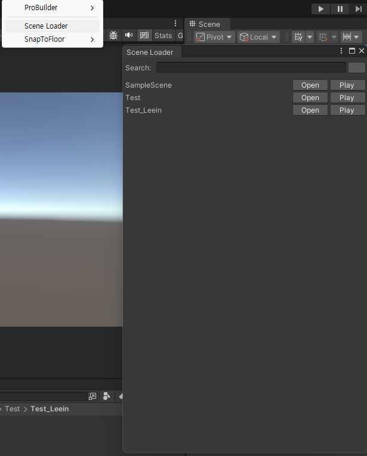

# 2026/01/27 화요일
## 1.씬 간편 이동 툴 제작  
[Tools]--> [Scene Loader]이동할 씬 open누르면 편하게 이동  

  

-------
##  2.자동 저장 툴 제작  
작업 하고 저장해야하는 귀찮음 때문에 만듦  
씬 실행하면 자동 저장된다.  
 
--- 

## 3.BreakablePlatform제작 
1.밟으면 1.5초 뒤에 사라짐  
2.1.5사이동안 색 변경  
3. 3초후 오브젝트 다시 활성화    
 
 --끝--