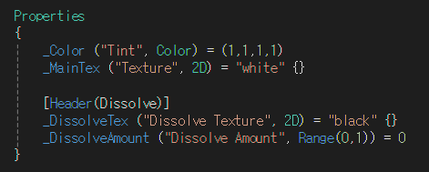
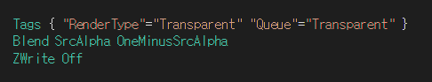
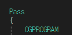
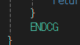
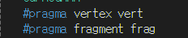
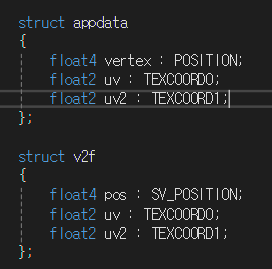
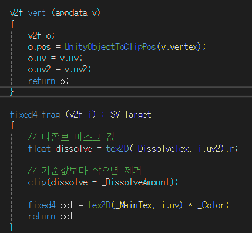
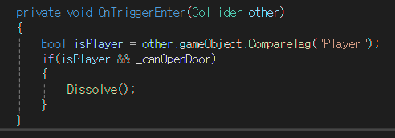
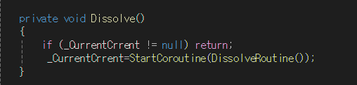
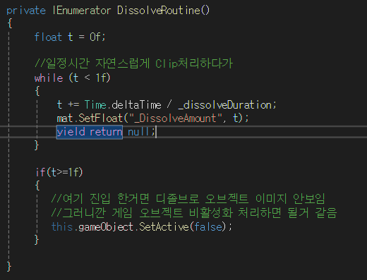

# 1. 주요 속성 (Properties)

***프로퍼티:**   
사용자가 인스펙터 창에서 조절할 수 있는 값들입니다.

_MainTex:  
 캐릭터나 오브젝트의 실제 모습이 담긴 기본 이미지입니다.

_DissolveTex:   
디졸브의 '모양'을 결정하는 노이즈 텍스처입니다. 이 텍스처의 R(빨간색) 채널 값을 기준으로 어디서부터 사라질지 결정합니다.

_DissolveAmount:  
 0에서 1 사이의 값으로, 얼마나 많이 녹아내릴지를 결정하는 슬라이더입니다.

---
컴퓨터가 그림을 그릴 때의 '규칙'을 정하는 부분입니다.  
Tags { "RenderType"="Transparent" "Queue"="Transparent" }  

### Queue=Transparent:  
 유니티가 물체를 그리는 순서를 정합니다.  
  "이 물체는 투명하니까 배경을 다 그린 다음에 그 위에 그려줘!"라고 요청하는 것입니다.

---
### Blend SrcAlpha OneMinusSrcAlpha

가장 대중적인 알파 블렌딩(Alpha Blending) 설정입니다.  
 물체의 투명도(Alpha)에 따라 뒤에 있는 배경과 자연스럽게 섞이도록 만듭니다.  

---

 ### ZWrite Off

**깊이 값 쓰기(Z-Write)**를 끕니다.  
 투명한 물체는 자기 뒤에 있는 물체를 가리면 안 되기 때문에, "내가 여기 앞에 있다고 기록하지 마!"라고 말하는 것과 같습니다.  

    

---
### pass{}
SubShader가 셰이더의 전체 설정을 담는 큰 틀이라면,  
 **Pass**는 GPU가 물체를 한 번 그려내기 위해 수행하는 실제 작업 지시서입니다.

---

### CGPROGRAM & ENDCG
여기부터 GPU 코드 시작이다 선언 구간  
ENDCG 여기까지가 GPU 코드다    

 

---
 ###  #pragma vertex vert
 ###  #pragma fragment frag

GPU한테 어떤 함수를 실행할지 지정하는 지시문  
- 정점 셰이더로 vert 함수 써라
-  픽셀(프래그먼트) 셰이더로 frag 함수 써라  
  

 ---

 ###   #include "UnityCG.cginc"

**유니티가 미리 만들어 둔 GPU 유틸 함수 모음 가져와라**  
Unity에서 제공하는 공용 CG/HLSL 함수·매크로·구조체를 포함한다    

대표적으로 들어있는 것  
🔹 좌표 변환 (제일 많이 씀)  
UnityObjectToClipPos(v.vertex)

오브젝트 → 클립 공간 변환  

---  
### Properties에서 설정한 값들을 CGPROGRAM 안에서 쓰기 위한 변수 선언

sampler2D _MainTex;  
  -  2D 텍스처 핸들
  -  머티리얼의 _MainTex 슬롯과 연결됨  
  -  tex2D()로 샘플링함  
  예시)  
  fixed4 col = tex2D(_MainTex, i.uv);
  

float4 _Color;  
   - RGBA 색상  
   - Color 타입 → 내부적으로 float4  
  
  sampler2D _DissolveTex;  
  - 디졸브용 노이즈 텍스처  
  - 흑백 텍스처 많이 사용   
  예시 : float noise = tex2D(_DissolveTex, i.uv).r;  

  float _DissolveAmount;  
  - 디졸브 진행도 (보통 0~1)  
  -  C#에서 애니메이션으로 올리는 값  
  

  ---
 
   

 이 두 struct는 GPU 파이프라인에서 “입력 → 출력” 데이터 통로다.  
셰이더 이해의 핵심 중 핵심  

| 필드명 | 시맨틱 | 의미 |
|------|--------|------|
| vertex | POSITION | 정점 좌표 (오브젝트 공간) |
| uv | TEXCOORD0 | 메인 UV |
| uv2 | TEXCOORD1 | 보조 UV (라이트맵, 마스크 등) |  

시맨틱(semantic) : 이 값이 뭔지 GPU에 알려주는 꼬리표

| 필드명 | 시맨틱 | 의미 |
|------|--------|------|
| pos | SV_POSITION | 클립 공간 좌표 (필수) |
| uv | TEXCOORD0 | 보간된 UV |
| uv2 | TEXCOORD1 | 보간된 보조 UV |  

---
1. 정점 셰이더 (Vertex Shader):  
모델의 **'모양과 위치'**를 결정하는 단계입니다.  

- o.pos = UnityObjectToClipPos(v.vertex);  
  - 3D 공간에 있는 캐릭터의 점들을 카메라가 보는 2D 화면 좌표로 변환합니다. 이게 없으면 물체가 화면 어디에 그려질지 알 수 없습니다.   
- o.uv = v.uv; / o.uv2 = v.uv2;  
    - 메인 텍스처와 디졸브용 노이즈 텍스처를 입힐 **'지도 좌표'**를 다음 단계(frag)로 토스합니다.  
  

 2. 픽셀 셰이더 (Fragment Shader):  
화면의 **'각 픽셀의 색상'**을 결정하고, 깎아내는 단계입니다.  

- float dissolve = tex2D(_DissolveTex, i.uv2).r;

    - 준비된 노이즈 텍스처(_DissolveTex)에서 픽셀의 밝기(r) 값을 가져옵니다.  
    -  0(검정)부터 1(흰색) 사이의 값  
- clip(dissolve - _DissolveAmount);  
   -  이 셰이더의 핵심입니다! 노이즈 값에서 내가 설정한 슬라이더(_DissolveAmount) 값을 뺍니다.
   -  결과가 0보다 작으면(마이너스) 해당 픽셀을 즉시 삭제(clip)하여 투명하게 만듭니다.  
-  fixed4 col = tex2D(_MainTex, i.uv) * _Color; return col;
   -  _MainTex라는 도화지(텍스처)에서 i.uv라는 좌표(위치)에 있는 색깔을 콕 집어 가져온다.  
   -  가져온 텍스처 색상에 사용자가 인스펙터 창에서 선택한 _Color 값을 곱합  
   - 삭제되지 않고 살아남은 픽셀에만 메인 텍스처 색상을 입혀서 화면에 출력합니다.  

  
---
  

일단 충돌 했을 때 플레이어인지 판별하고  
풀레이어가 충돌 했을 때 문을 열수 있는지 없는지 판별 후  
열수 있으면 문을 연다.  

---
  

코루틴 중복 실행 방지  
 
---
이제 이걸 사용 하는 DissolveController.cs 스크립트로 가서 보면  
  
 트리거를 당겼을 때  코루틴을 실행한다.  
_DissolveAmount의 값을 증가시켜 천천히 사라지는 연출 보여준다.    
다 사라지면  오브젝트 비활성시켜 플레이어가 지나갈수 있게 만든다.  

---

코드 리팩토링 요소 
하드 코딩 한 부분 수정 필요  
인터페이스 사용해볼법한 것 연구  
