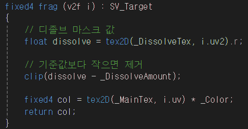
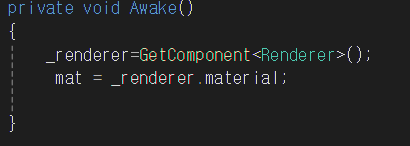
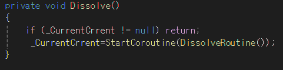
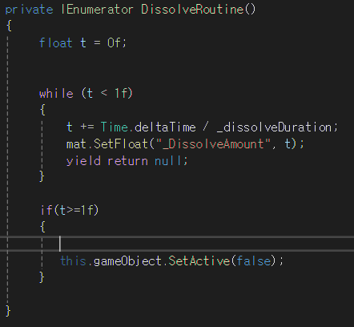
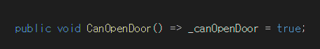

# DissolvePlatform
먼저 셰이더 핵심코드  보자면  

---
1. ``float dissolve = tex2D(_DissolveTex, i.uv2).r;``  
- _DissolveTex는 흑백 텍스처
- 보통 노이즈 텍스처를 사용함
- ``.r`` → 빨간 채널 값 (0 ~ 1)  

의미  
“이 픽셀이 언제 사라질지 정하는 값”  
- 0.0 → 제일 먼저 사라질 픽셀
- 1.0 → 제일 늦게 사라질 픽셀  
즉, 픽셀마다 사라지는 타이밍이 다르다는 걸 만들어주는 핵심 요소  

---
2. _DissolveAmount : 진행도 (컨트롤 값)
  
``clip(dissolve - _DissolveAmount);``  

### clip() 함수  
- x < 0 → 픽셀 완전 제거
- x >= 0 → 픽셀 유지  

---

### 흐름

1. tex2D(_DissolveTex, i.uv2).r;는
해당 텍스처의 i.uv2 UV 좌표에서 r값을(0~1) 추출     

2. clip(dissolve - _DissolveAmount); 0보다 작으면 픽셀 제거.  여기서 제거되면 밑에 ``실행 안함  ``
3. ``fixed4 col = tex2D(_MainTex, i.uv) * _Color;`` ``return col;``   살아남은 픽셀은 출력한다.

---
### 결론
노이즈 텍스처 값이 _DissolveAmount보다 작은 픽셀은 제거하고, 나머지만 원본 텍스처를 그린다  

---
# 셰이더 제어 부분   
### DissolveController.cs사용하여 제어했다.  

### 시작 : 제어할 메테리얼을 가져와 저장한다.  
  
## 검사 :플레이어랑 닿았을 때 실행가능한지 판별 후 실행가능하면 천천히 사라지는 연출 실행한다. 

---
### 연출을 작동 시킬 때 이미 작동 중이면 중복 호출되지 않도록 코드 설정

---

### 셰이더 내부에 _DissolveAmount값을 증가시켜 사라지는 연출 작동시킨다.  
### 작동이 완료되면 플레이어가 지나갈수 있도록 게임오브젝트를 비활성 시킨다.  

---

이 기믹이 실행될수 있게 해주는 메서드인데  
이 메서드는 다른 아이템 오브젝트에 DissolveController참조 시킨 후  충돌시 실행되게 만들었다.   

