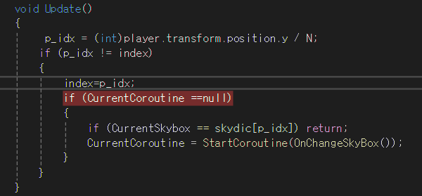
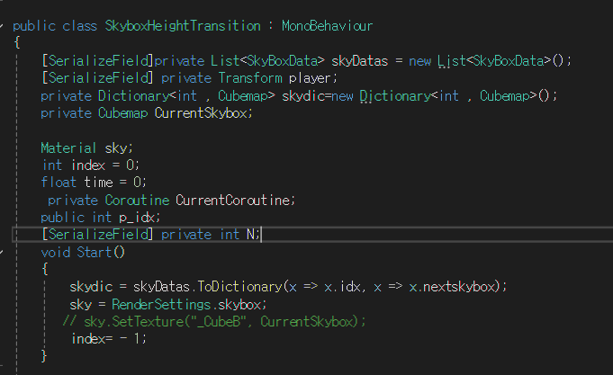

# 플레이어 높이(Y) 기반 스카이박스 전환 시스템  
## 1. 전환 조건 검사 (Update 로직)  

플레이어의 Transform.position.y 좌표를 참조하여 실시간으로 스카이박스 교체 여부를 판단합니다.  

인덱스 산출: 플레이어의 높이 값을 $N$으로 나눈 몫을 스카이박스 인덱스(p_idx)로 사용합니다.  

실행 조건:  
   -  새로 산출된 인덱스가 기존 인덱스와 다를 경우에만 전환 프로세스를 시작합니다.  

- 중복 실행 방지: 현재 전환 코루틴(CurrentCoroutine)이 동작 중이거나, 교체하려는 스카이박스가 현재 적용된 것과 동일하다면 실행하지 않고 반환(return)합니다.

---

# 2. 스카이박스 교체 및 트랜지션 로직 (Coroutine)  

조건이 충족되면 딕셔너리(skydic)에서 해당 인덱스의 스카이박스를 추출하여 단계별로 전환을 수행합니다.

텍스처 설정: skydic에서 가져온 스카이박스를 셰이더의 타겟 텍스처(_CubeB)에 할당합니다.

보간(Transition) 진행: while 문을 통해 일정 시간 동안 _Blend 값을 0에서 1까지 점진적으로 증가시켜 부드러운 전환 효과를 연출합니다.

데이터 스왑 및 초기화: * 트랜지션이 완료되면 현재 _CubeB의 텍스처를 추출하여 _CubeA에 복사합니다.

이후 _Blend 값과 경과 시간(time)을 0으로 초기화합니다.

사후 처리: 이 과정을 거침으로써 다음 전환 시에도 동일한 로직으로 자연스러운 스카이박스 교체가 가능해집니다.   
작업이 끝나면 CurrentCoroutine 변수를 null로 비워 다음 입력을 대기합니다.

---
# 로직 수정 필요 

1. 굳이 2개의 코루틴이 필요하지 않음  
2. Update에서 메서드로 추출하고 리펙토링 할 필요 있어보임.  
3. 변수명 정리 필요  
   

   ----
4. 변수명 재설정 필요  
 